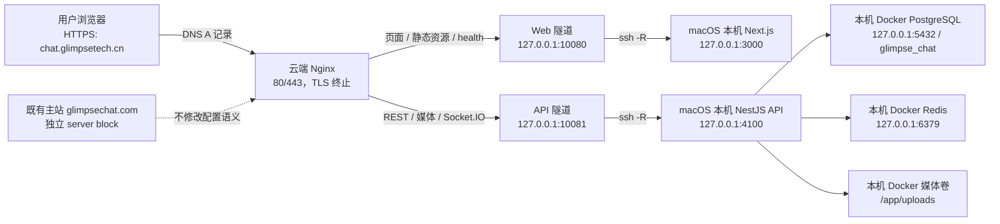

# Glimpse Chat 远程部署完整操作手册

> 目标域名：`chat.glimpsetech.cn`  
> 部署模式：本机 Next.js/NestJS/PostgreSQL + 双路 SSH 反向隧道 + 云端独立 Nginx + Let's Encrypt HTTPS  
> 文档日期：2026-07-13  
> 适用本机：macOS，项目目录 `/Users/a1/projects/glimpse-chat-v2`  
> 适用云端：TencentOS Server 3；云端 Nginx 使用自定义二进制与配置路径

## 1. 项目总览、目标与边界

Glimpse Chat 是一个 pnpm 管理的 monorepo。`apps/web` 是 Next.js 15 前端/PWA；`apps/api` 是 NestJS REST + Socket.IO API；共享类型位于 `packages/shared`。本次部署还使用本机 Docker PostgreSQL、Redis、Mailpit 和持久化媒体卷。

本次不是把整个项目迁移到云服务器，也不是替换正在运行的主站 `https://glimpsechat.com`。目标是让新子域名 `https://chat.glimpsetech.cn`：

- 页面、`/_next/*` 静态资源和 `/health` 来自当前 macOS 工作区构建的 Next.js 服务；
- API、认证、媒体、后台和 Socket.IO 均来自本机 NestJS（`127.0.0.1:4100`），并连接本机 Docker PostgreSQL；
- 浏览器始终访问一个 HTTPS 域名，不知道本机 IP、云端 API 端口或隧道端口；
- 主站的 Nginx server block、上游和应用进程不被替换；
- 本机 `3000/4100`、云端 `10080/10081` 以及本地 PostgreSQL `5432` 均不暴露到公网。

这种方式适合「需要持续映射本机构建、且本机能长期在线」的场景。本机休眠、关机或网络断开时，新子域名的页面会返回 502；主站不会受影响。若要长期生产化，应将 Web 构建物部署到受管理的云端运行环境或 CI/CD 发布机。

## 2. 部署架构



请求按路径分流：

| 请求 | Nginx 上游 | 原因 |
| --- | --- | --- |
| `/`、`/_next/*`、`/health` | `127.0.0.1:10080` | 让子域名呈现当前本机 Web 构建 |
| `/health/ready`、`/health/live` | 云端 `127.0.0.1:10081` → 本机 `127.0.0.1:4100` | 验证本机 API 与本地数据库状态 |
| `/auth/*`、`/conversations*`、`/contacts/*`、`/search/*`、`/favorites/*`、`/media/*`、`/admin/*`、`/feedback*`、`/voice/*`、`/api/*` | 云端 `127.0.0.1:10081` → 本机 `127.0.0.1:4100` | 所有业务接口使用本机 NestJS 和本地数据 |
| `/socket.io/*` | 云端 `127.0.0.1:10081` → 本机 `127.0.0.1:4100` | 本机 Socket.IO polling/WebSocket |
| `glimpsechat.com` | 原有 upstream | 既有主站保持独立 |

## 3. 已确认的实施参数与关键发现

| 项目 | 值 | 说明 |
| --- | --- | --- |
| 公网域名 | `chat.glimpsetech.cn` | 新增独立入口 |
| 云服务器公网 IPv4 | `43.129.183.132` | DNS A 记录目标 |
| 本机项目目录 | `/Users/a1/projects/glimpse-chat-v2` | 当前工作区 |
| 本机 Web | `127.0.0.1:3000` | Next.js 生产服务，仅回环监听 |
| 云端 Web 隧道 | `127.0.0.1:10080` | 转发到本机 `127.0.0.1:3000` |
| 云端 API 隧道 | `127.0.0.1:10081` | 转发到本机 `127.0.0.1:4100` |
| 本机 API 数据库 | Docker `db:5432/glimpse_chat` | 对宿主机仅映射 `127.0.0.1:5432` |
| 本机媒体存储 | Docker volume `uploads:/app/uploads` | `/media/*` 经 API 隧道读写本地媒体卷 |
| 证书 | Let's Encrypt | 为 `chat.glimpsetech.cn` 单独签发 |

云端不是 Debian/Ubuntu 的标准 `systemctl nginx` 布局：`systemctl nginx` 为 inactive，`/etc/nginx/nginx.conf` 不存在。真实 Nginx 由以下命令启动：

```sh
/root/bin/nginx -c /root/glimpse-chat/nginx/nginx.conf
```

因此，所有配置检查都必须使用：

```sh
/root/bin/nginx -t -c /root/glimpse-chat/nginx/nginx.conf
```

平滑加载必须向真实主进程发送 HUP：

```sh
kill -HUP "$(cat /root/glimpse-chat/nginx/nginx.pid)"
```

**不要**使用不存在的 `/etc/nginx/nginx.conf`，也不要为了这个子域名 stop/start Nginx。错误路径会给出误导性检查结果；stop/start 会增加主站中断风险。

## 4. 开始前的安全原则

1. 在修改 SSHD 时，保留当前已登录的管理 SSH 会话；新开一个会话验证成功后再关闭旧会话。
2. 每次改 SSHD：先执行 `sshd -t`，成功后才 reload。
3. 每次改 Nginx：先执行真实路径的 `nginx -t`，成功后才 HUP。
4. 隧道使用独立用户 `tunnel` 和独立 ed25519 私钥；不得复用 root、管理员或日常开发密钥。
5. SSH 反向转发必须分别是 `127.0.0.1:10080:127.0.0.1:3000` 和 `127.0.0.1:10081:127.0.0.1:4100`，禁止绑定到 `0.0.0.0`。
6. 密码、私钥、完整 `authorized_keys` 公钥行不写入本手册、代码库、截图或聊天记录。
7. 在云厂商安全组中只开放 TCP `80/443` 以及既有的 SSH 管理端口；`10080/10081` 和本机 `4100/5432` 不创建公网规则。

## 5. 第一步：盘点云端现状并备份

以云端管理员/root 身份执行。先读取现状而不是先改配置，这一步用于避免端口冲突、确认真实 Nginx 实例，并建立可回滚点。

```sh
ss -lntp
ps -ef | grep '[n]ginx'
tr '\0' ' ' </proc/$(cat /root/glimpse-chat/nginx/nginx.pid)/cmdline
/root/bin/nginx -t -c /root/glimpse-chat/nginx/nginx.conf
curl -kfsSI --resolve glimpsechat.com:443:127.0.0.1 https://glimpsechat.com/
ss -lntp 'sport = :10080 or sport = :10081'
```

通过标准：真实 Nginx 配置检测通过；主站返回 HTTP 200；`10081` 尚未被其他进程占用，`10080` 只被既有 Web 隧道使用。若端口冲突，先调查占用进程；不要直接杀进程。若改用其他端口，必须同步更新 `permitlisten`、LaunchAgent 的 `-R` 和 Nginx upstream。

创建带时间戳备份：

```sh
stamp=$(date +%Y%m%d-%H%M%S)
cp -a /etc/ssh/sshd_config /etc/ssh/sshd_config.bak-$stamp
cp -a /root/glimpse-chat/nginx/conf/conf.d/chat.glimpsetech.cn.dev.conf \
  /root/glimpse-chat/nginx/conf/conf.d/chat.glimpsetech.cn.dev.conf.bak-$stamp
```

为什么：Nginx 配置文件是新子域名唯一需要替换的云端业务配置；保留独立备份后，故障时可只回滚它而不触碰主站。

## 6. 第二步：创建受限的云端隧道账户

### 6.1 创建账户与 SSH 目录

```sh
useradd --create-home --home-dir /home/tunnel --shell /usr/sbin/nologin tunnel
install -d -m 700 -o tunnel -g tunnel /home/tunnel/.ssh
install -m 600 -o tunnel -g tunnel /dev/null /home/tunnel/.ssh/authorized_keys
```

`/usr/sbin/nologin` 防止该账户被当作日常 shell 用户使用；该账户只承载受限制的 SSH 会话。

### 6.2 为 tunnel 用户增加 SSHD 限制

该服务器未使用 `sshd_config.d` 的 Include 机制。将下面完整块放到 `/etc/ssh/sshd_config` **末尾**，并确保后面没有新的 `Match` 块覆盖它：

```text
Match User tunnel
    PasswordAuthentication no
    KbdInteractiveAuthentication no
    PermitTTY no
    X11Forwarding no
    AllowAgentForwarding no
    AllowTcpForwarding remote
    GatewayPorts no
    PermitTunnel no
    PermitUserRC no
```

这些限制的目的：

- 禁用密码和键盘交互认证，避免账户成为暴力登录目标；
- 禁用 TTY、X11、agent、隧道设备及用户 rc 脚本，缩小密钥泄露后的能力；
- `AllowTcpForwarding remote` 只允许 `ssh -R`，拒绝本地和动态转发；
- `GatewayPorts no` 防止服务端把反向转发自动绑定到公网地址。

保持当前管理会话不关闭，验证后再加载：

```sh
sshd -t
systemctl reload sshd
sshd -T -C user=tunnel,host=localhost,addr=127.0.0.1 | \
  grep -E '^(passwordauthentication|kbdinteractiveauthentication|permittty|x11forwarding|allowagentforwarding|allowtcpforwarding|gatewayports|permittunnel|permituserrc)'
id tunnel
```

期望：认证/TTY/X11/agent 均为 `no`，`allowtcpforwarding remote`，`gatewayports no`。若 `sshd -t` 失败，先从备份恢复或修正刚添加的 Match 块；不要 reload。

## 7. 第三步：生成专用密钥并限制可监听端口

### 7.1 在 macOS 本机生成密钥

在本机用户账户执行，私钥始终只留在本机：

```sh
install -d -m 700 "$HOME/.ssh"
ssh-keygen -t ed25519 -f "$HOME/.ssh/id_ed25519_chat_tunnel" -N '' \
  -C 'chat.glimpsetech.cn reverse tunnel'
chmod 600 "$HOME/.ssh/id_ed25519_chat_tunnel"
ssh-keygen -lf "$HOME/.ssh/id_ed25519_chat_tunnel.pub"
```

`-N ''` 表示该自动守护进程使用无交互口令的专用密钥；安全性来自私钥文件权限、专用账户、SSHD Match 规则和单端口 `permitlisten` 的叠加限制。不要发送或备份私钥文件。

### 7.2 在云端授权公钥

将**本机 `.pub` 文件的一整行公钥**粘贴到云端 `/home/tunnel/.ssh/authorized_keys`。前置选项必须保留；下面的 `AAAA...` 仅为占位符：

```text
no-agent-forwarding,no-X11-forwarding,no-pty,permitlisten="127.0.0.1:10080",permitlisten="127.0.0.1:10081" ssh-ed25519 AAAA... chat.glimpsetech.cn reverse tunnel
```

然后修正权限：

```sh
chown tunnel:tunnel /home/tunnel/.ssh/authorized_keys
chmod 600 /home/tunnel/.ssh/authorized_keys
```

两个 `permitlisten` 是第二道边界：该密钥只能在云端回环地址监听 Web `10080` 和 API `10081`，不能增加其他转发。

### 7.3 固定云端主机指纹

先在云端记录指纹：

```sh
ssh-keygen -lf /etc/ssh/ssh_host_ed25519_key.pub
```

再在本机抓取并核对。仅在两边显示的 SHA256 指纹完全相同后，保存 known_hosts：

```sh
ssh-keyscan -T 5 -t ed25519 43.129.183.132 > "$HOME/.ssh/known_hosts_chat_tunnel"
chmod 600 "$HOME/.ssh/known_hosts_chat_tunnel"
ssh-keygen -lf "$HOME/.ssh/known_hosts_chat_tunnel"
```

这样 `StrictHostKeyChecking=yes` 可以阻止客户端在主机被替换或遭遇中间人攻击时自动接受新密钥。

## 8. 第四步：启动本机 API/数据库并以 same-origin 构建 Web

浏览器访问 `chat.glimpsetech.cn` 时，前端不能把 API 地址写为浏览器自己的 `localhost:4100`。使用 `same-origin` 构建后，前端请求当前域名；云端 Nginx 再经 `10081` 隧道把 API 与 Socket.IO 送回本机。

先启动本机数据库、Redis、邮件测试服务和 API。`.env` 中的 `API_BIND_ADDRESS` 必须为 `127.0.0.1`：

```sh
cd /Users/a1/projects/glimpse-chat-v2
docker compose up -d db redis mailpit api
docker compose ps
curl --noproxy '*' -fsS http://127.0.0.1:4100/health/ready
```

Docker API 使用 `DATABASE_URL=postgresql://...@db:5432/glimpse_chat`，其中 `db` 是本机 Compose 网络中的 PostgreSQL 服务，不是云端数据库。

```sh
cd /Users/a1/projects/glimpse-chat-v2
NEXT_PUBLIC_API_URL=same-origin \
NEXT_PUBLIC_SOCKET_URL=same-origin \
corepack pnpm --filter @glimpse/web build
```

临时启动并检查：

```sh
corepack pnpm --filter @glimpse/web exec next start -H 127.0.0.1 -p 3000
curl --noproxy '*' -fsS http://127.0.0.1:3000/health
lsof -nP -iTCP:3000 -sTCP:LISTEN
```

健康检查应返回类似 `{"ok":true}` 的 JSON，监听地址应为 `127.0.0.1:3000` 而不是 `0.0.0.0:3000`。用 `-H 127.0.0.1` 是为了避免本机 Web 服务被局域网直接访问。

## 9. 第五步：使用 LaunchAgent 守护本机 Web 和隧道

终端前台进程会在关闭终端、断线或重新登录后消失，因此使用两个用户级 LaunchAgent。它们会在用户登录后自动启动，并在异常退出后重试。

先创建日志和 LaunchAgent 目录：

```sh
mkdir -p "$HOME/Library/LaunchAgents" "$HOME/Library/Logs/GlimpseChat"
```

### 9.1 Web LaunchAgent

创建 `~/Library/LaunchAgents/com.glimpsechat.web.plist`：

```xml
<?xml version="1.0" encoding="UTF-8"?>
<!DOCTYPE plist PUBLIC "-//Apple//DTD PLIST 1.0//EN" "http://www.apple.com/DTDs/PropertyList-1.0.dtd">
<plist version="1.0"><dict>
  <key>Label</key><string>com.glimpsechat.web</string>
  <key>ProgramArguments</key><array>
    <string>/bin/zsh</string><string>-lc</string>
    <string>cd /Users/a1/projects/glimpse-chat-v2 &amp;&amp; exec /usr/local/bin/corepack pnpm --filter @glimpse/web exec next start -H 127.0.0.1 -p 3000</string>
  </array>
  <key>WorkingDirectory</key><string>/Users/a1/projects/glimpse-chat-v2</string>
  <key>RunAtLoad</key><true/>
  <key>KeepAlive</key><true/>
  <key>ThrottleInterval</key><integer>10</integer>
  <key>StandardOutPath</key><string>/Users/a1/Library/Logs/GlimpseChat/web.out.log</string>
  <key>StandardErrorPath</key><string>/Users/a1/Library/Logs/GlimpseChat/web.err.log</string>
</dict></plist>
```

如果 `command -v corepack` 不是 `/usr/local/bin/corepack`，先执行 `command -v corepack`，再把 XML 中的路径替换成实际绝对路径。LaunchAgent 不读取交互 shell 的 PATH，这是使用绝对路径的原因。

### 9.2 SSH 隧道 LaunchAgent

创建 `~/Library/LaunchAgents/com.glimpsechat.tunnel.plist`：

```xml
<?xml version="1.0" encoding="UTF-8"?>
<!DOCTYPE plist PUBLIC "-//Apple//DTD PLIST 1.0//EN" "http://www.apple.com/DTDs/PropertyList-1.0.dtd">
<plist version="1.0"><dict>
  <key>Label</key><string>com.glimpsechat.tunnel</string>
  <key>ProgramArguments</key><array>
    <string>/usr/bin/ssh</string><string>-NT</string>
    <string>-i</string><string>/Users/a1/.ssh/id_ed25519_chat_tunnel</string>
    <string>-o</string><string>BatchMode=yes</string>
    <string>-o</string><string>IdentitiesOnly=yes</string>
    <string>-o</string><string>ExitOnForwardFailure=yes</string>
    <string>-o</string><string>ServerAliveInterval=30</string>
    <string>-o</string><string>ServerAliveCountMax=3</string>
    <string>-o</string><string>StrictHostKeyChecking=yes</string>
    <string>-o</string><string>UserKnownHostsFile=/Users/a1/.ssh/known_hosts_chat_tunnel</string>
    <string>-R</string><string>127.0.0.1:10080:127.0.0.1:3000</string>
    <string>-R</string><string>127.0.0.1:10081:127.0.0.1:4100</string>
    <string>tunnel@43.129.183.132</string>
  </array>
  <key>RunAtLoad</key><true/>
  <key>KeepAlive</key><true/>
  <key>ThrottleInterval</key><integer>10</integer>
  <key>StandardOutPath</key><string>/Users/a1/Library/Logs/GlimpseChat/tunnel.out.log</string>
  <key>StandardErrorPath</key><string>/Users/a1/Library/Logs/GlimpseChat/tunnel.err.log</string>
</dict></plist>
```

参数含义：`-N -T` 不执行远端命令也不申请终端；`BatchMode=yes` 避免等待密码；`ExitOnForwardFailure=yes` 让端口无法监听时立即失败并由 LaunchAgent 重试；`ServerAlive*` 在网络变化后主动判定死连接；`StrictHostKeyChecking=yes` 只接受已核对的主机指纹。

加载并启动两个服务：

```sh
launchctl bootstrap gui/$(id -u) "$HOME/Library/LaunchAgents/com.glimpsechat.web.plist"
launchctl bootstrap gui/$(id -u) "$HOME/Library/LaunchAgents/com.glimpsechat.tunnel.plist"
launchctl kickstart -k gui/$(id -u)/com.glimpsechat.web
launchctl kickstart -k gui/$(id -u)/com.glimpsechat.tunnel
launchctl print gui/$(id -u)/com.glimpsechat.web
launchctl print gui/$(id -u)/com.glimpsechat.tunnel
```

若同名任务已存在，先执行对应 `launchctl bootout gui/$(id -u)/...`，再 bootstrap，避免重复加载错误。

## 10. 第六步：验证云端回环隧道

在云端执行：

```sh
ss -lntp 'sport = :10080 or sport = :10081'
curl -fsS --max-time 10 http://127.0.0.1:10080/health
curl -fsS --max-time 10 http://127.0.0.1:10081/health/ready
```

通过标准：两个端口都只显示为 `127.0.0.1`，监听进程为 `sshd`；`10080` 返回 Web 健康 JSON，`10081` 返回本机 API 就绪状态。若任一端口显示为 `0.0.0.0`，立即停止隧道并修正。

## 11. 第七步：配置独立 Nginx 子域名

编辑云端生效文件：

```text
/root/glimpse-chat/nginx/conf/conf.d/chat.glimpsetech.cn.dev.conf
```

以下为核心结构；正式配置以仓库根目录 `chat.glimpsetech.cn.conf` 为准。HTTPS 块按路径将页面和 API 分别送入两个本机隧道：

```nginx
upstream chat_local_web {
    server 127.0.0.1:10080;
}

upstream chat_local_api {
    server 127.0.0.1:10081;
}

server {
    listen 80;
    listen [::]:80;
    server_name chat.glimpsetech.cn;

    location ^~ /.well-known/acme-challenge/ {
        alias /root/nginx/acme/.well-known/acme-challenge/;
        default_type text/plain;
    }

    location / { return 301 https://$host$request_uri; }
}

server {
    listen 443 ssl;
    listen [::]:443 ssl;
    http2 on;
    server_name chat.glimpsetech.cn;

    ssl_certificate     /root/letsencrypt/config/live/chat.glimpsetech.cn/fullchain.pem;
    ssl_certificate_key /root/letsencrypt/config/live/chat.glimpsetech.cn/privkey.pem;
    ssl_protocols TLSv1.2 TLSv1.3;
    ssl_ciphers HIGH:!aNULL:!MD5;
    client_max_body_size 750m;

    location ^~ /.well-known/acme-challenge/ {
        alias /root/nginx/acme/.well-known/acme-challenge/;
        default_type text/plain;
    }

    location ~ ^/health/(live|ready)$ {
        proxy_pass http://chat_local_api;
        proxy_http_version 1.1;
        proxy_set_header Host $host;
        proxy_set_header X-Forwarded-For $proxy_add_x_forwarded_for;
        proxy_set_header X-Forwarded-Proto $scheme;
    }

    location /socket.io/ {
        proxy_pass http://chat_local_api;
        proxy_http_version 1.1;
        proxy_set_header Upgrade $http_upgrade;
        proxy_set_header Connection "upgrade";
        proxy_set_header Host $host;
        proxy_set_header X-Real-IP $remote_addr;
        proxy_set_header X-Forwarded-For $proxy_add_x_forwarded_for;
        proxy_set_header X-Forwarded-Proto $scheme;
        proxy_read_timeout 86400s;
    }

    location ~ ^/(auth|conversations|contacts|search|favorites|media|admin|feedback|voice|api)(/|$) {
        proxy_pass http://chat_local_api;
        proxy_http_version 1.1;
        proxy_set_header Host $host;
        proxy_set_header X-Real-IP $remote_addr;
        proxy_set_header X-Forwarded-For $proxy_add_x_forwarded_for;
        proxy_set_header X-Forwarded-Proto $scheme;
        proxy_connect_timeout 10s;
        proxy_send_timeout 300s;
        proxy_read_timeout 300s;
    }

    location / {
        proxy_pass http://chat_local_web;
        proxy_http_version 1.1;
        proxy_set_header Host $host;
        proxy_set_header X-Real-IP $remote_addr;
        proxy_set_header X-Forwarded-For $proxy_add_x_forwarded_for;
        proxy_set_header X-Forwarded-Proto $scheme;
        proxy_set_header Upgrade $http_upgrade;
        proxy_set_header Connection "upgrade";
        proxy_connect_timeout 10s;
        proxy_send_timeout 300s;
        proxy_read_timeout 300s;
    }
}
```

`/socket.io/` 必须在普通 API 正则和 `/` 之前单独声明，且必须传递 `Upgrade`/`Connection` 请求头；否则网页可能能打开但实时连接失败。`X-Forwarded-Proto` 让后端知道公网请求是 HTTPS，从而正确处理安全 Cookie 和回调 URL。

检查并平滑加载：

```sh
/root/bin/nginx -t -c /root/glimpse-chat/nginx/nginx.conf
kill -HUP "$(cat /root/glimpse-chat/nginx/nginx.pid)"
curl -kfsSI --resolve glimpsechat.com:443:127.0.0.1 https://glimpsechat.com/
```

主站仍须为 HTTP 200；若不是，立刻按第 15 节回滚 chat 独立文件。

## 12. 第八步：HTTP-01 验证、签发 HTTPS 证书

先验证 Nginx 的 ACME 路径，避免让 Certbot 在错误的路由上反复失败：

```sh
token=acme-check-$(date +%s)
printf '%s\n' "$token" > /root/nginx/acme/.well-known/acme-challenge/$token
curl -fsS http://chat.glimpsetech.cn/.well-known/acme-challenge/$token
```

公网输出必须与 `$token` 完全一致。若失败，检查 DNS A 记录、云安全组 TCP 80、Nginx 的 `server_name` 和 `alias` 路径。

该云端的 Certbot 使用自定义目录。申请证书时，将下面的通知邮箱替换为实际运维邮箱：

```sh
/root/.local/bin/certbot certonly --webroot \
  -w /root/nginx/acme \
  -d chat.glimpsetech.cn \
  -m your-notification-email@example.com \
  --agree-tos --no-eff-email --non-interactive \
  --config-dir /root/letsencrypt/config \
  --work-dir /root/letsencrypt/work \
  --logs-dir /root/letsencrypt/logs \
  --cert-name chat.glimpsetech.cn
```

成功后检查证书的域名：

```sh
openssl x509 -in /root/letsencrypt/config/live/chat.glimpsetech.cn/fullchain.pem \
  -noout -subject -ext subjectAltName
```

CN/SAN 必须包含 `chat.glimpsetech.cn`。签发后再执行一次第 11 节的语法检查和 HUP，使 Nginx 读取新证书。

## 13. 第九步：证书自动续期与续期后平滑加载

创建 `/root/glimpse-chat/scripts/reload-nginx-after-cert-renewal.sh`：

```sh
#!/bin/sh
set -eu
kill -HUP "$(cat /root/glimpse-chat/nginx/nginx.pid)"
```

限制为 root 可执行：

```sh
chmod 700 /root/glimpse-chat/scripts/reload-nginx-after-cert-renewal.sh
```

创建 `/etc/cron.d/glimpse-letsencrypt-renew`，内容如下：

```cron
SHELL=/bin/sh
PATH=/usr/local/sbin:/usr/local/bin:/usr/sbin:/usr/bin:/sbin:/bin
22 3 * * * root /root/.local/bin/certbot renew --quiet --config-dir /root/letsencrypt/config --work-dir /root/letsencrypt/work --logs-dir /root/letsencrypt/logs --deploy-hook /root/glimpse-chat/scripts/reload-nginx-after-cert-renewal.sh >> /root/letsencrypt/logs/renew-cron.log 2>&1
```

验证 cron 和 dry-run：

```sh
systemctl is-active crond
/root/.local/bin/certbot renew --dry-run \
  --config-dir /root/letsencrypt/config \
  --work-dir /root/letsencrypt/work \
  --logs-dir /root/letsencrypt/logs \
  --deploy-hook /root/glimpse-chat/scripts/reload-nginx-after-cert-renewal.sh
```

使用 deploy hook 的原因是证书文件更新后 Nginx 需要平滑加载，才会向新连接提供新证书。

## 14. 上线验收清单

全部项目通过才算部署完成：

| 检查项 | 命令/方法 | 合格标准 |
| --- | --- | --- |
| 本机 Web | `curl --noproxy '*' -fsS http://127.0.0.1:3000/health` | 返回健康 JSON |
| Web 守护 | `launchctl print gui/$(id -u)/com.glimpsechat.web` | `state = running` |
| 隧道守护 | `launchctl print gui/$(id -u)/com.glimpsechat.tunnel` | `state = running` |
| 本机 API/DB | `docker compose ps` | API、db、Redis 均 healthy/running |
| 本地会话数 | `docker exec ... psql ... count(*)` | 与新域名登录后的列表来源一致 |
| 云端隧道 | `ss -lntp 'sport = :10080 or sport = :10081'` | 两者都仅绑定 `127.0.0.1` |
| Web 隧道 | `curl -fsS http://127.0.0.1:10080/health` | 返回本机 Web 健康 JSON |
| API 隧道 | `curl -fsS http://127.0.0.1:10081/health/ready` | 返回本机 API 就绪状态 |
| HTTP | `curl -I http://chat.glimpsetech.cn/` | 301 到 HTTPS |
| HTTPS 页面 | `curl -I https://chat.glimpsetech.cn/` | 200，无证书错误 |
| API 分流 | `curl -i https://chat.glimpsetech.cn/auth/me` | 未登录时正常 401，非 404/502 |
| Socket.IO | `curl 'https://chat.glimpsetech.cn/socket.io/?EIO=4&transport=polling'` | 返回 Socket.IO handshake JSON |
| 主站回归 | `curl -I https://glimpsechat.com/` | 保持 200 |
| 续期 | `certbot renew --dry-run` | 模拟成功 |

还应从外部网络检查 `10080/10081`：都不应被访问。最终还要用一个仅存在于本地数据库的账户/会话验证新域名，证明数据确实来自本地 PostgreSQL。

### 14.1 本次实施完成记录（2026-07-13）

本次切换已完成，当前线上数据链路为：`chat.glimpsetech.cn` → 云端 Nginx → 云端回环端口 `10081` → SSH 反向隧道 → 本机 NestJS `127.0.0.1:4100` → Docker 网络内的 `db:5432/glimpse_chat`。云服务器原有 API 和云端 PostgreSQL 不再承接新域名的业务接口。

实际验收结果：

| 验收项 | 实测结果 | 结论 |
| --- | --- | --- |
| Nginx 配置一致性 | 本地与云端 SHA-256 均为 `f965cf95e37094523b655088989ae819c538efb6a332aff13b969a5b38c3fa28` | 云端运行配置与交付配置一致 |
| Nginx 语法 | `/root/bin/nginx -t -c /root/glimpse-chat/nginx/nginx.conf` 成功 | 可安全平滑加载 |
| 云端监听 | `10080/10081` 均仅监听 `127.0.0.1`，进程为 `sshd` | 隧道端口未暴露公网 |
| 本机 Web | LaunchAgent 为 `running`，仅监听 `127.0.0.1:3000` | 页面来自本机 Web |
| 本机 API | 容器运行，宿主机仅映射 `127.0.0.1:4100` | API 未暴露到局域网/公网 |
| 本机 PostgreSQL | 容器健康，宿主机仅映射 `127.0.0.1:5432` | 数据库仅本机可达 |
| Web 健康检查 | `https://chat.glimpsetech.cn/health` 返回 `glimpse-web v32.80` | Web 隧道正常 |
| API/数据库检查 | `https://chat.glimpsetech.cn/health/ready` 返回 `glimpse-api v32.80`、`database: ok` | API 隧道和本地 DB 正常 |
| 认证路由 | 未登录访问 `/auth/me` 返回 401 | API 路由正常，且未误落到前端 |
| Socket.IO | polling 返回有效 handshake，并声明可升级为 WebSocket | 实时接口正常 |
| 数据闭环 | 两分钟临时 JWT 请求公网 `/conversations`：HTTP 200；公网会话数 `1` 与该本地测试用户的数据库成员数 `1` 完全一致 | 公网业务接口确实读取本地数据库 |
| 主站回归 | `https://glimpsechat.com/` 返回 200 | 原主站未受影响 |

本地数据库在验收时的全局计数为：`Conversation = 3`、`Message = 5`、`User = 5`。因此“本地 PostgreSQL 有 5 个、页面曾显示 6 个”中的“5 个”很可能是消息数或用户数，而不是 `Conversation` 表的全局会话数；登录后页面只展示当前用户加入的会话，也不能直接与全局表数量比较。

切换前，新域名只更换了前端页面来源，API 仍落到云服务器既有的 `localhost:5432/glimpse_chat`，所以会显示与 `glimpsechat.com` 相同的数据。切换后，本机 API 已使用独立随机 JWT 密钥，云端原服务签发的旧令牌不应继续有效。首次访问时应退出并重新登录；若仍看到旧的 6 条记录，清除 `chat.glimpsetech.cn` 的站点数据（Cookie、localStorage、Cache Storage/Service Worker）后重新登录，再以 `/health/ready` 和当前账户列表复核。

验收过程中还发现 Compose Web 容器与 LaunchAgent Web 重复监听 `3000`。已停止重复容器，并把 `docker-compose.yml` 的 Web 端口映射收紧为 `127.0.0.1:3000:3000`；当前生产入口保留 LaunchAgent 守护的 Web 服务，避免端口来源歧义和局域网暴露。

## 15. 日常运维与前端更新

### 查看状态和日志

```sh
# 本机
launchctl print gui/$(id -u)/com.glimpsechat.web
launchctl print gui/$(id -u)/com.glimpsechat.tunnel
tail -f ~/Library/Logs/GlimpseChat/web.err.log
tail -f ~/Library/Logs/GlimpseChat/tunnel.err.log

# 云端
ss -lntp 'sport = :10080 or sport = :10081'
tail -f /root/glimpse-chat/nginx/chat.glimpsetech.cn.error.log
/root/bin/nginx -t -c /root/glimpse-chat/nginx/nginx.conf
```

### 发布新的本机前端代码

每次前端代码变化后，只需重建并重启本机 Web；云端 Nginx 和隧道均无需修改：

```sh
cd /Users/a1/projects/glimpse-chat-v2
NEXT_PUBLIC_API_URL=same-origin NEXT_PUBLIC_SOCKET_URL=same-origin \
  corepack pnpm --filter @glimpse/web build
launchctl kickstart -k gui/$(id -u)/com.glimpsechat.web
curl --noproxy '*' -fsS http://127.0.0.1:3000/health
```

## 16. 故障排查

| 现象 | 优先检查 | 处理方向 |
| --- | --- | --- |
| 页面 `502 Bad Gateway` | 云端 `curl http://127.0.0.1:10080/health` | 检查本机 Web 与隧道 |
| API `502 Bad Gateway` | 云端 `curl http://127.0.0.1:10081/health/ready` | 检查本机 Docker API、数据库和 API 隧道 |
| 隧道无法监听 | 本机 `tunnel.err.log`、云端 `ss` | 确认 `10080/10081`、两个 `permitlisten` 与两个 `-R` 完全一致 |
| 证书申请失败 | `/.well-known/acme-challenge/` | 检查 DNS、80 端口、Nginx webroot alias；不要跳过验证 |
| HTTPS 域名错误 | `openssl x509 ... subjectAltName` | 确认 chat server block 指向 chat 专用证书 |
| 页面可打开，API 404 | Nginx API location | 确认请求前缀被正则涵盖，前端必须以 same-origin 构建 |
| Socket.IO 断开 | `/socket.io/` location | 检查 Upgrade/Connection 和 `proxy_read_timeout` |
| 主站异常 | 主站 curl、Nginx 备份 | 立即回滚 chat 独立配置并 HUP；不覆盖主站配置 |

## 17. 回滚方案

回滚只影响新子域名。优先恢复独立 Nginx 文件，再确认主站，最后再停本机进程。

### 17.1 回滚 Nginx 子域名配置

```sh
cp -a /root/glimpse-chat/nginx/conf/conf.d/chat.glimpsetech.cn.dev.conf.bak-<时间戳> \
  /root/glimpse-chat/nginx/conf/conf.d/chat.glimpsetech.cn.dev.conf
/root/bin/nginx -t -c /root/glimpse-chat/nginx/nginx.conf
kill -HUP "$(cat /root/glimpse-chat/nginx/nginx.pid)"
curl -kfsSI --resolve glimpsechat.com:443:127.0.0.1 https://glimpsechat.com/
```

`nginx -t` 失败时不得 HUP；先修复或恢复备份。

### 17.2 停止本机服务和隧道

```sh
launchctl bootout gui/$(id -u)/com.glimpsechat.tunnel
launchctl bootout gui/$(id -u)/com.glimpsechat.web
```

### 17.3 确认永久下线后移除授权

先从 `/home/tunnel/.ssh/authorized_keys` 删除该专用公钥行，然后：

```sh
chown tunnel:tunnel /home/tunnel/.ssh/authorized_keys
chmod 600 /home/tunnel/.ssh/authorized_keys
```

若要彻底移除账户，先删除 `/etc/ssh/sshd_config` 的 `Match User tunnel` 块，执行 `sshd -t` 和 reload，再执行：

```sh
userdel -r tunnel
```

不要先删用户再删 Match 规则，否则会留下难以审计的无效策略。

## 18. 交接后的安全建议

- 尽快轮换曾在交互式管理中使用过的初始管理员密码，并改用最小权限管理员账户和 SSH 公钥登录。
- 保持 `id_ed25519_chat_tunnel` 仅存于 `~/.ssh`，权限为 `600`，不提交 Git、不放入备份压缩包、不通过即时通信工具传输。
- 定期执行 `ss -lntp 'sport = :10080 or sport = :10081'`，确认两个监听都仍是 `127.0.0.1`。
- 定期查看 `~/Library/Logs/GlimpseChat/tunnel.err.log`；本机睡眠、网络变化或重新登录后，应由 LaunchAgent 自动恢复。
- 每次改 Nginx 均使用 `/root/bin/nginx -t -c /root/glimpse-chat/nginx/nginx.conf`，通过后才 HUP。
