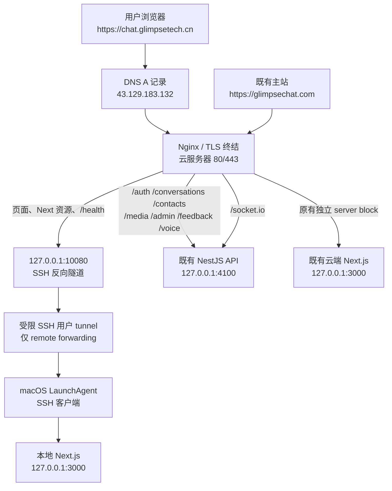

# Glimpse Chat 本地项目域名部署运行手册

> 文档用途：记录从需求分析、风险识别到上线验收的完整实施过程。本文描述的是已落地的架构；命令中的私钥、公钥和密码均不应写入文档、代码库或聊天记录。

| 项目 | 已部署值 | 说明 |
|---|---|---|
| 公网域名 | `chat.glimpsetech.cn` | 本次新增的独立入口 |
| 云服务器 | `43.129.183.132` | TencentOS Server 3 |
| 本地项目目录 | `/Users/a1/projects/glimpse-chat-v2` | macOS 上运行的当前工作区 |
| 本地 Web 端口 | `127.0.0.1:3000` | Next.js 生产服务，仅回环监听 |
| 云端隧道端口 | `127.0.0.1:10080` | 仅供云端 Nginx 访问，禁止公网开放 |
| 云端 API | `127.0.0.1:4100` | 既有 API 服务；由新域名同源反向代理 |
| 主站 | `https://glimpsechat.com` | 既有服务，实施期间保持不变 |
| 证书 | Let's Encrypt | 覆盖 `chat.glimpsetech.cn`，有效期至 2026-10-11 |

## 1. 项目总览

Glimpse Chat 是 pnpm 管理的前后端工作区：`apps/web` 是 Next.js 前端，`apps/api` 是 NestJS API。云服务器上原本已有一套正在运行的服务：主站 Nginx 将 `glimpsechat.com` 分流到云端的 Next.js（`127.0.0.1:3000`）和 API（`127.0.0.1:4100`）。

目标不是替换主站，也不是把本地端口暴露到公网；目标是为 `chat.glimpsetech.cn` 增加一条彼此隔离的访问链路，使其首页与前端静态资源来自当前 macOS 工作区，而同源 API 与 Socket.IO 继续安全地使用云端既有 API。这样既可以发布当前本地前端，又不会重启、替换或覆盖主站服务。

### 1.1 为什么采用 SSH 反向隧道

- 本地开发机通常没有稳定公网地址，也不应把 3000 端口直接暴露到互联网。
- 云服务器已有可用的 80/443、DNS 和 Nginx，因此公网入口应继续集中在云端。
- 反向隧道由本地发起，即使本地网络处于 NAT 后也可连接；云端只需要在回环地址监听一个内部端口。
- 使用独立的 SSH 用户、独立密钥和 `permitlisten` 限制，可以把该账户的能力收敛为“仅建立指定端口的反向转发”。

## 2. 架构图



### 2.1 请求分流表

| 请求类型 | Nginx 上游 | 目的 | 原因 |
|---|---|---|---|
| `/`、`/_next/*`、`/health` | `127.0.0.1:10080` | 当前本机 Next.js | 确保新域名实际呈现当前本地工作区构建 |
| `/auth/*`、`/conversations*`、`/contacts/*`、`/media/*`、`/admin/*`、`/feedback*`、`/voice/*`、`/api/*` | `127.0.0.1:4100` | 云端既有 API | 页面使用 `same-origin`，浏览器无需直接暴露 API 端口 |
| `/socket.io/*` | `127.0.0.1:4100` | 云端 Socket.IO | 传递 Upgrade/Connection 头，支持实时连接 |
| `glimpsechat.com` | 原有 upstream | 原云端 Web/API | 原服务不改配置语义，仅执行平滑 reload |

## 3. 实施前分析与风险控制

### 3.1 必须先确认的事实

1. DNS：`chat.glimpsetech.cn` 的 A 记录已解析到云服务器公网 IP。
2. 云端端口：80/443 已由现有 Nginx 占用；10080 未占用。
3. 本地监听：部署开始时 macOS 未有项目端口监听，因此不能把“本地正在运行”作为假设，必须先构建和启动 Web 服务。
4. 云端 Nginx 非标准安装：`systemctl nginx` 为 inactive，`/etc/nginx/nginx.conf` 不存在；真实实例由 `/root/bin/nginx -c /root/glimpse-chat/nginx/nginx.conf` 启动。后续所有语法检查和 reload 必须使用这个真实路径。
5. 原服务隔离：`chat.glimpsetech.cn` 已有独立配置文件且初始返回 503；主站 `glimpsechat.com` 有独立 server block。因此只替换 chat 的配置文件即可，绝不修改主站 server block。

### 3.2 不可跳过的安全原则

- 绝不将本地 3000、云端 10080 或云端 API 4100 开放为公网业务端口。
- 反向隧道的监听地址必须是 `127.0.0.1:10080`，禁止使用 `0.0.0.0`。
- 不复用 root 或日常管理员 SSH 私钥；隧道使用单独密钥。
- 修改 `sshd` 前保留当前管理会话；先运行 `sshd -t`，成功后再 reload。
- 修改 Nginx 前先运行真实实例的 `nginx -t`；成功后仅 HUP/reload，不做无必要的 restart。
- 每一步均保留可回滚备份；主站每次切换后必须重新检查 HTTP 200。

## 4. 第一步：盘点现状与建立备份

在云服务器以具备 sudo/root 权限的管理账户执行。不要先写配置，先确认端口、现有 Nginx 和实际命令路径。

```bash
ss -lntp
ps -ef | grep '[n]ginx'
tr '\0' ' ' </proc/$(cat /root/glimpse-chat/nginx/nginx.pid)/cmdline
/root/bin/nginx -t -c /root/glimpse-chat/nginx/nginx.conf
curl -kfsSI --resolve glimpsechat.com:443:127.0.0.1 https://glimpsechat.com/
ss -lntp 'sport = :10080'
```

为什么：标准 `nginx -t` 在该服务器会指向不存在的 `/etc/nginx/nginx.conf`。使用错误路径会得出“配置故障”的假结论，甚至可能对错误实例执行 restart。真实主进程的 `cmdline` 是唯一可靠依据。

创建带时间戳的备份：

```bash
stamp=$(date +%Y%m%d-%H%M%S)
cp -a /etc/ssh/sshd_config /etc/ssh/sshd_config.bak-$stamp
cp -a /root/glimpse-chat/nginx/conf/conf.d/chat.glimpsetech.cn.dev.conf \
  /root/glimpse-chat/nginx/conf/conf.d/chat.glimpsetech.cn.dev.conf.bak-$stamp
```

## 5. 第二步：创建受限云端隧道账户

### 5.1 创建账户和 SSH 目录

```bash
useradd --create-home --home-dir /home/tunnel --shell /usr/sbin/nologin tunnel
install -d -m 700 -o tunnel -g tunnel /home/tunnel/.ssh
install -m 600 -o tunnel -g tunnel /dev/null /home/tunnel/.ssh/authorized_keys
```

该账户没有可交互 shell，因此不能被用于日常登录；它只承载一条受限制的 SSH 会话。

### 5.2 为该用户加 SSHD 限制

本服务器未使用 `sshd_config.d` Include 机制，因此把以下块追加到 `/etc/ssh/sshd_config` 的末尾（必须位于任何后续 `Match` 块之前或作为文件最后一个 Match 块）：

```text
Match User tunnel
    PasswordAuthentication no
    KbdInteractiveAuthentication no
    PermitTTY no
    X11Forwarding no
    AllowAgentForwarding no
    AllowTcpForwarding remote
    GatewayPorts no
    PermitTunnel no
    PermitUserRC no
```

各限制的含义：

- `PasswordAuthentication no` / `KbdInteractiveAuthentication no`：账户不能用密码暴力登录。
- `PermitTTY no`：即使密钥泄露，也不能获得交互终端。
- `AllowTcpForwarding remote`：仅允许 `ssh -R`；禁止本地/动态转发。
- `GatewayPorts no`：服务端不会把反向端口自动绑定到公网地址。
- 其余项关闭 X11、agent、隧道设备和用户 rc 脚本，减少横向能力。

保留当前 root SSH 会话后执行：

```bash
sshd -t
systemctl reload sshd
sshd -T -C user=tunnel,host=localhost,addr=127.0.0.1 | \
  grep -E '^(passwordauthentication|kbdinteractiveauthentication|permittty|x11forwarding|allowagentforwarding|allowtcpforwarding|gatewayports|permittunnel|permituserrc)'
id tunnel
```

期望值：密码认证、TTY、X11、agent 均为 `no`；`allowtcpforwarding remote`；`gatewayports no`。

## 6. 第三步：创建专用密钥并限制可监听端口

在 macOS 本机生成密钥；不应把私钥复制到服务器：

```bash
install -d -m 700 "$HOME/.ssh"
ssh-keygen -t ed25519 -f "$HOME/.ssh/id_ed25519_chat_tunnel" -N '' \
  -C 'chat.glimpsetech.cn reverse tunnel'
chmod 600 "$HOME/.ssh/id_ed25519_chat_tunnel"
ssh-keygen -lf "$HOME/.ssh/id_ed25519_chat_tunnel.pub"
```

在云端把公钥写入 `/home/tunnel/.ssh/authorized_keys`。关键是前置选项，而不是仅写入公钥本身：

```text
no-agent-forwarding,no-X11-forwarding,no-pty,permitlisten="127.0.0.1:10080" ssh-ed25519 AAAA... chat.glimpsetech.cn reverse tunnel
```

`permitlisten` 是第二道边界：即使将来 SSHD 的用户级配置被误改，该密钥仍只能请求监听 `127.0.0.1:10080`。随后修正权限：

```bash
chown tunnel:tunnel /home/tunnel/.ssh/authorized_keys
chmod 600 /home/tunnel/.ssh/authorized_keys
```

固定主机指纹，拒绝首次连接时的盲目信任：

```bash
# 云端：记录并人工保存 SHA256 指纹
ssh-keygen -lf /etc/ssh/ssh_host_ed25519_key.pub

# 本机：仅在两侧指纹完全一致后保存
ssh-keyscan -T 5 -t ed25519 43.129.183.132 > "$HOME/.ssh/known_hosts_chat_tunnel"
chmod 600 "$HOME/.ssh/known_hosts_chat_tunnel"
ssh-keygen -lf "$HOME/.ssh/known_hosts_chat_tunnel"
```

## 7. 第四步：构建并启动本地 Web 服务

### 7.1 以 same-origin 模式构建

```bash
cd /Users/a1/projects/glimpse-chat-v2
NEXT_PUBLIC_API_URL=same-origin \
NEXT_PUBLIC_SOCKET_URL=same-origin \
corepack pnpm --filter @glimpse/web build
```

为什么：浏览器访问 `chat.glimpsetech.cn` 时，前端将 API 和 Socket 地址解析为当前域名。Nginx 再按路径转发到云端 API，浏览器不需要知道 4100 端口，也不需要跨域访问本地网络。

### 7.2 只监听回环地址

```bash
corepack pnpm --filter @glimpse/web exec next start -H 127.0.0.1 -p 3000
curl --noproxy '*' -fsS http://127.0.0.1:3000/health
lsof -nP -iTCP:3000 -sTCP:LISTEN
```

期望：健康检查返回 JSON；监听地址是 `127.0.0.1:3000`，不是 `0.0.0.0:3000`。

## 8. 第五步：将本地服务与隧道交给 LaunchAgent

短暂的终端会话不可靠。macOS 需要由 LaunchAgent 在登录后自动拉起 Web 和 SSH 进程。

### 8.1 Web LaunchAgent

文件：`~/Library/LaunchAgents/com.glimpsechat.web.plist`

核心 `ProgramArguments`：

```text
/bin/zsh -lc
cd /Users/a1/projects/glimpse-chat-v2 && exec /usr/local/bin/corepack pnpm --filter @glimpse/web exec next start -H 127.0.0.1 -p 3000
```

必需属性：`RunAtLoad=true`、`KeepAlive=true`、`ThrottleInterval=10`，并把 stdout/stderr 写入 `~/Library/Logs/GlimpseChat/`。

### 8.2 SSH 隧道 LaunchAgent

文件：`~/Library/LaunchAgents/com.glimpsechat.tunnel.plist`

核心参数：

```text
/usr/bin/ssh -NT
  -i /Users/a1/.ssh/id_ed25519_chat_tunnel
  -o BatchMode=yes
  -o IdentitiesOnly=yes
  -o ExitOnForwardFailure=yes
  -o ServerAliveInterval=30
  -o ServerAliveCountMax=3
  -o StrictHostKeyChecking=yes
  -o UserKnownHostsFile=/Users/a1/.ssh/known_hosts_chat_tunnel
  -R 127.0.0.1:10080:127.0.0.1:3000
  tunnel@43.129.183.132
```

关键参数说明：

- `-N -T`：不执行远端命令、不申请终端。
- `BatchMode=yes`：密钥或主机验证异常时立即失败并由 LaunchAgent 重试，不会阻塞等待密码。
- `ExitOnForwardFailure=yes`：若云端 10080 无法监听，SSH 直接失败，避免“看似在线、实际没通”的半失效状态。
- `ServerAlive*`：本地网络中断后让 SSH 及时退出，`KeepAlive` 再拉起。
- `StrictHostKeyChecking=yes`：避免主机被替换时自动接受未知主机指纹。

安装与加载：

```bash
mkdir -p "$HOME/Library/LaunchAgents" "$HOME/Library/Logs/GlimpseChat"
launchctl bootstrap gui/$(id -u) "$HOME/Library/LaunchAgents/com.glimpsechat.web.plist"
launchctl bootstrap gui/$(id -u) "$HOME/Library/LaunchAgents/com.glimpsechat.tunnel.plist"
launchctl kickstart -k gui/$(id -u)/com.glimpsechat.web
launchctl kickstart -k gui/$(id -u)/com.glimpsechat.tunnel
launchctl print gui/$(id -u)/com.glimpsechat.web
launchctl print gui/$(id -u)/com.glimpsechat.tunnel
```

## 9. 第六步：验证云端回环隧道

云端执行：

```bash
ss -lntp 'sport = :10080'
curl -fsS --max-time 10 http://127.0.0.1:10080/health
```

期望：只出现 `127.0.0.1:10080`，进程为 `sshd`；健康检查返回本地 Web 的 JSON。若显示为 `0.0.0.0:10080`，立即停止隧道，检查 `-R` 地址、`GatewayPorts` 和 `permitlisten`。

## 10. 第七步：配置独立 Nginx 站点

实际生效文件：

```text
/root/glimpse-chat/nginx/conf/conf.d/chat.glimpsetech.cn.dev.conf
```

核心配置如下。完整配置中，HTTP 块仅用于 ACME 与 HTTPS 跳转；HTTPS 块把前端流量送到隧道，把 API/实时路径送到云端现有 API。

```nginx
upstream chat_local_web {
    server 127.0.0.1:10080;
}

server {
    listen 80;
    listen [::]:80;
    server_name chat.glimpsetech.cn;

    location ^~ /.well-known/acme-challenge/ {
        alias /root/nginx/acme/.well-known/acme-challenge/;
        default_type text/plain;
    }

    location / { return 301 https://$host$request_uri; }
}

server {
    listen 443 ssl;
    listen [::]:443 ssl;
    http2 on;
    server_name chat.glimpsetech.cn;

    ssl_certificate     /root/letsencrypt/config/live/chat.glimpsetech.cn/fullchain.pem;
    ssl_certificate_key /root/letsencrypt/config/live/chat.glimpsetech.cn/privkey.pem;
    ssl_protocols TLSv1.2 TLSv1.3;
    ssl_ciphers HIGH:!aNULL:!MD5;
    client_max_body_size 750m;

    location ^~ /.well-known/acme-challenge/ {
        alias /root/nginx/acme/.well-known/acme-challenge/;
        default_type text/plain;
    }

    location /socket.io/ {
        proxy_pass http://127.0.0.1:4100;
        proxy_http_version 1.1;
        proxy_set_header Upgrade $http_upgrade;
        proxy_set_header Connection "upgrade";
        proxy_set_header Host $host;
        proxy_set_header X-Real-IP $remote_addr;
        proxy_set_header X-Forwarded-For $proxy_add_x_forwarded_for;
        proxy_set_header X-Forwarded-Proto $scheme;
        proxy_read_timeout 86400s;
    }

    location ~ ^/(auth|conversations|contacts|media|admin|feedback|voice|api)(/|$) {
        proxy_pass http://127.0.0.1:4100;
        proxy_http_version 1.1;
        proxy_set_header Host $host;
        proxy_set_header X-Real-IP $remote_addr;
        proxy_set_header X-Forwarded-For $proxy_add_x_forwarded_for;
        proxy_set_header X-Forwarded-Proto $scheme;
        proxy_connect_timeout 10s;
        proxy_send_timeout 300s;
        proxy_read_timeout 300s;
    }

    location / {
        proxy_pass http://chat_local_web;
        proxy_http_version 1.1;
        proxy_set_header Host $host;
        proxy_set_header X-Real-IP $remote_addr;
        proxy_set_header X-Forwarded-For $proxy_add_x_forwarded_for;
        proxy_set_header X-Forwarded-Proto $scheme;
        proxy_set_header Upgrade $http_upgrade;
        proxy_set_header Connection "upgrade";
        proxy_connect_timeout 10s;
        proxy_send_timeout 300s;
        proxy_read_timeout 300s;
    }
}
```

启用前后使用真实 Nginx 路径：

```bash
/root/bin/nginx -t -c /root/glimpse-chat/nginx/nginx.conf
kill -HUP "$(cat /root/glimpse-chat/nginx/nginx.pid)"
```

为什么优先 HUP：它进行平滑重载，旧 worker 会处理完现有请求后退出；相比 stop/start，不会人为中断主站连接。实际实施中，使用 `nginx -s reload` 后验证仍命中旧配置，因此以主 PID 的 `kill -HUP` 作为可靠切换方式，并再次验证新 worker 与新证书。

## 11. 第八步：签发 HTTPS 证书与验证 ACME

先用临时文件确认 HTTP-01 路径已正确路由：

```bash
token=acme-check-$(date +%s)
printf '%s\n' "$token" > /root/nginx/acme/.well-known/acme-challenge/$token
curl -fsS http://chat.glimpsetech.cn/.well-known/acme-challenge/$token
```

确认公网输出与 token 一致后签发。该服务器的 Certbot 位于 `/root/.local/bin/certbot`，并使用已有自定义目录：

```bash
/root/.local/bin/certbot certonly --webroot \
  -w /root/nginx/acme \
  -d chat.glimpsetech.cn \
  -m <通知邮箱> \
  --agree-tos --no-eff-email --non-interactive \
  --config-dir /root/letsencrypt/config \
  --work-dir /root/letsencrypt/work \
  --logs-dir /root/letsencrypt/logs \
  --cert-name chat.glimpsetech.cn
```

签发成功后检查：

```bash
openssl x509 -in /root/letsencrypt/config/live/chat.glimpsetech.cn/fullchain.pem \
  -noout -subject -ext subjectAltName
```

期望：CN 和 SAN 都包含 `chat.glimpsetech.cn`。不要复用只覆盖主站的证书，否则浏览器会报域名不匹配。

## 12. 第九步：设置证书自动续期

创建部署后 reload 脚本 `/root/glimpse-chat/scripts/reload-nginx-after-cert-renewal.sh`：

```bash
#!/bin/sh
set -eu
kill -HUP "$(cat /root/glimpse-chat/nginx/nginx.pid)"
```

设为仅 root 可执行：

```bash
chmod 700 /root/glimpse-chat/scripts/reload-nginx-after-cert-renewal.sh
```

创建 `/etc/cron.d/glimpse-letsencrypt-renew`：

```cron
SHELL=/bin/sh
PATH=/usr/local/sbin:/usr/local/bin:/usr/sbin:/usr/bin:/sbin:/bin
22 3 * * * root /root/.local/bin/certbot renew --quiet --config-dir /root/letsencrypt/config --work-dir /root/letsencrypt/work --logs-dir /root/letsencrypt/logs --deploy-hook /root/glimpse-chat/scripts/reload-nginx-after-cert-renewal.sh >> /root/letsencrypt/logs/renew-cron.log 2>&1
```

验证 cron 正常运行且所有证书均可续期：

```bash
systemctl is-active crond
/root/.local/bin/certbot renew --dry-run \
  --config-dir /root/letsencrypt/config \
  --work-dir /root/letsencrypt/work \
  --logs-dir /root/letsencrypt/logs \
  --deploy-hook /root/glimpse-chat/scripts/reload-nginx-after-cert-renewal.sh
```

## 13. 上线验收清单

| 检查项 | 命令或方法 | 通过标准 |
|---|---|---|
| 本地 Web | `curl http://127.0.0.1:3000/health` | 返回 `{ "ok": true }` |
| macOS 守护 | `launchctl print gui/$(id -u)/com.glimpsechat.web` | `state = running` |
| 隧道守护 | `launchctl print gui/$(id -u)/com.glimpsechat.tunnel` | `state = running` |
| 云端隧道 | `ss -lntp 'sport = :10080'` | 仅 `127.0.0.1:10080` |
| 隧道内容 | `curl http://127.0.0.1:10080/health` | 返回本地 Web 的健康 JSON |
| HTTP 跳转 | `curl -I http://chat.glimpsetech.cn/` | 301 到 HTTPS |
| HTTPS 页面 | `curl -I https://chat.glimpsetech.cn/` | 200，响应来自 Next.js |
| 本地构建一致性 | 比对公网与本机页面 ETag | 两者一致 |
| API 分流 | `curl -i https://chat.glimpsetech.cn/auth/me` | 未认证时正常 401，不是 404/502 |
| Socket.IO | `curl 'https://chat.glimpsetech.cn/socket.io/?EIO=4&transport=polling'` | 返回 Socket.IO handshake JSON |
| 主站回归 | `curl -I https://glimpsechat.com/` | 保持 200 |
| 续期 | `certbot renew --dry-run` | 所有证书模拟续期成功 |

本次实际验收结果：HTTP 301、HTTPS 200、`/health` 200、`/auth/me` 401、Socket.IO polling handshake 成功、主站 200、证书 dry-run 成功。公网对 10080 的 HTTP 探测未获得服务内容，服务器 socket 状态确认其仅绑定回环地址。

## 14. 日常运维

### 14.1 查看状态和日志

```bash
# 本机
launchctl print gui/$(id -u)/com.glimpsechat.web
launchctl print gui/$(id -u)/com.glimpsechat.tunnel
tail -f ~/Library/Logs/GlimpseChat/web.err.log
tail -f ~/Library/Logs/GlimpseChat/tunnel.err.log

# 云端
ss -lntp 'sport = :10080'
tail -f /root/glimpse-chat/nginx/chat.glimpsetech.cn.error.log
/root/bin/nginx -t -c /root/glimpse-chat/nginx/nginx.conf
```

### 14.2 更新本地前端

每次前端代码更新后，按以下顺序执行：

```bash
cd /Users/a1/projects/glimpse-chat-v2
NEXT_PUBLIC_API_URL=same-origin NEXT_PUBLIC_SOCKET_URL=same-origin \
  corepack pnpm --filter @glimpse/web build
launchctl kickstart -k gui/$(id -u)/com.glimpsechat.web
curl --noproxy '*' -fsS http://127.0.0.1:3000/health
```

无需修改云端 Nginx；隧道会把新 Web 进程直接呈现到现有域名。

### 14.3 常见故障定位

| 现象 | 优先检查 | 处理 |
|---|---|---|
| 502 Bad Gateway | 云端 `curl 127.0.0.1:10080/health` | 检查本机 Web LaunchAgent、隧道 LaunchAgent 和密钥/主机指纹 |
| 隧道无法监听 | 远端 SSH 日志与 `ss -lntp` | 确认 10080 未占用、`permitlisten` 与 `-R` 完全一致 |
| 证书申请失败 | `/.well-known/acme-challenge/` | 确认 DNS、80 端口和 webroot alias；不要先强制跳过验证 |
| HTTPS 证书错误 | `openssl x509 ... subjectAltName` | 确认 Nginx 指向 chat 专用证书，而不是主站证书 |
| 页面能开、API 404 | Nginx location 与路径 | 检查 API 正则路径是否包括请求前缀；浏览器前端必须使用 `same-origin` 构建 |
| Socket.IO 断开 | `/socket.io/` location | 检查 Upgrade/Connection 头和 `proxy_read_timeout` |
| 主站异常 | 主站 curl、Nginx 备份 | 立即回滚 chat 独立文件并 HUP；不要覆盖 `glimpsechat.conf` |

## 15. 回滚方案

回滚只影响新子域名，不修改主站。

### 15.1 回滚 Nginx 站点

```bash
cp -a /root/glimpse-chat/nginx/conf/conf.d/chat.glimpsetech.cn.dev.conf.bak-<时间戳> \
  /root/glimpse-chat/nginx/conf/conf.d/chat.glimpsetech.cn.dev.conf
/root/bin/nginx -t -c /root/glimpse-chat/nginx/nginx.conf
kill -HUP "$(cat /root/glimpse-chat/nginx/nginx.pid)"
curl -kfsSI --resolve glimpsechat.com:443:127.0.0.1 https://glimpsechat.com/
```

### 15.2 停止本机服务和隧道

```bash
launchctl bootout gui/$(id -u)/com.glimpsechat.tunnel
launchctl bootout gui/$(id -u)/com.glimpsechat.web
```

### 15.3 删除隧道授权（确认不再需要后）

```bash
# 云端：从 authorized_keys 删除该专用公钥行后再检查权限
vi /home/tunnel/.ssh/authorized_keys
chown tunnel:tunnel /home/tunnel/.ssh/authorized_keys
chmod 600 /home/tunnel/.ssh/authorized_keys
```

如需彻底移除，先删除 `/etc/ssh/sshd_config` 中的 `Match User tunnel` 块，执行 `sshd -t` 与 reload，再执行 `userdel -r tunnel`。不要先删用户再改 SSHD 配置，否则会留下难以审计的无效策略。

## 16. 安全交接与后续建议

- 初始管理凭据曾在交互过程中使用；应尽快轮换 root 密码，并改用最小权限管理员账户与 SSH 密钥登录。
- 本机私钥 `id_ed25519_chat_tunnel` 不应进入 Git、备份压缩包或即时通信工具。建议仅保留在受保护的 `~/.ssh`，权限为 600。
- 定期检查 `ss -lntp 'sport = :10080'`，确保监听始终为 127.0.0.1。
- 定期查看 `~/Library/Logs/GlimpseChat/tunnel.err.log`；本机睡眠、网络变化或重启后，LaunchAgent 应自动恢复。
- 若要长期生产化，建议将本地项目迁移到受管理的云端运行环境或 CI/CD 发布机；当前方案适合需要持续映射本机构建、且本机能保持在线的场景。
- 任何 Nginx 修改都先运行 `/root/bin/nginx -t -c /root/glimpse-chat/nginx/nginx.conf`，再执行 HUP；不要使用不存在的 `/etc/nginx/nginx.conf` 路径。
