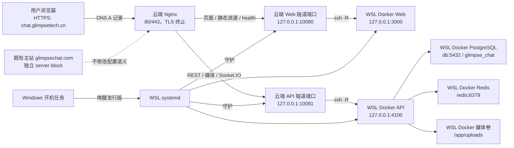

# Glimpse Chat Windows WSL 迁移与远程部署完整操作手册

> 目标域名：`chat.glimpsetech.cn`  
> 部署模式：Windows WSL2 + Docker Compose + 双路 SSH 反向隧道 + 云端独立 Nginx + Let's Encrypt HTTPS  
> 文档日期：2026-07-14  
> 适用 WSL：Ubuntu 22.04/24.04，建议项目目录 `/srv/glimpse-chat-v2`  
> 适用云端：TencentOS Server 3；云端 Nginx 使用自定义二进制与配置路径  
> 参考来源：`docs/（正式版）chat.glimpsetech.cn-本地项目域名部署运行手册.md`

## 1. 项目总览、迁移目标与边界

Glimpse Chat 是一个 pnpm 管理的 monorepo：`apps/web` 是 Next.js 15 前端/PWA，`apps/api` 是 NestJS REST + Socket.IO API，共享类型位于 `packages/shared`。生产运行依赖 Docker Compose 中的 PostgreSQL、Redis、API、Web 和持久化媒体卷。

当前 `chat.glimpsetech.cn` 的公网入口位于云服务器；Web 与 API 通过两条 SSH 反向隧道转发到 macOS。本次迁移的目标是把运行节点从 macOS 换成 Windows WSL2，同时保持：

- 公网域名、DNS A 记录和云服务器公网 IP 不变；
- TLS 仍由云端 Nginx 终止，Let's Encrypt 证书仍留在云端；
- 页面、API、媒体、Socket.IO 和数据库全部来自 WSL；
- `glimpsechat.com` 原主站不受影响；
- WSL 的 `3000/4100/5432/6379` 不暴露到局域网或公网；
- 数据库记录、用户密码哈希、聊天历史、收藏、后台配置和媒体文件完整迁移；
- Windows 重启后 WSL、Docker 和 SSH 隧道能够自动恢复。

本手册不是把项目安装到 Windows 原生 Node.js，也不是把数据库迁到云服务器。应用仍运行在 Linux 容器中，Windows 只负责承载 WSL2。

## 2. 目标架构



请求分流保持如下：

| 请求 | 云端 Nginx 上游 | 最终服务 |
| --- | --- | --- |
| `/`、`/_next/*`、`/health` | `127.0.0.1:10080` | WSL Web `127.0.0.1:3000` |
| `/health/live`、`/health/ready` | `127.0.0.1:10081` | WSL API `127.0.0.1:4100` |
| `/auth/*`、`/conversations*`、`/contacts*`、`/search*`、`/favorites*`、`/media*`、`/admin*`、`/feedback*`、`/voice*`、`/api/*` | `127.0.0.1:10081` | WSL API 与 WSL PostgreSQL |
| `/socket.io/*` | `127.0.0.1:10081` | WSL Socket.IO |
| `glimpsechat.com` | 原有 upstream | 原主站 |

## 3. 需要迁移与不需要迁移的内容

| 内容 | 迁移方法 | 要求 |
| --- | --- | --- |
| 项目源码 | WSL 中从 GitHub 克隆 | 不复制 macOS 的 `node_modules` 或构建目录 |
| 根目录 `.env` | 加密通道或受控移动存储 | 不提交 Git；在 WSL 中权限设为 `600` |
| PostgreSQL | `pg_dump -Fc` + `pg_restore` | 不直接复制 Docker 原始卷目录 |
| 媒体文件 | 打包并恢复 `uploads` Docker volume | 保留目录结构、文件名和权限 |
| Redis | 通常不迁移 | 验证码、限流和缓存允许失效 |
| Mailpit | 不迁移 | 当前真实 SMTP 配置来自 `.env` |
| SSH 隧道密钥 | 在 WSL 重新生成 | 不复制 macOS 私钥 |
| TLS 证书 | 不迁移 | 继续由云端 Nginx 使用 |
| `.next`、`dist`、`node_modules`、`*.tsbuildinfo` | 不迁移 | 在 WSL Docker 构建时重新生成 |
| macOS LaunchAgent plist | 不迁移 | WSL 改用 systemd |

数据库备份可能包含用户资料、聊天记录、管理员信息和数据库内的系统设置；媒体归档可能包含用户上传内容。两者均按敏感数据处理，不进入 Git，不通过公开网盘或即时通信明文传输。

## 4. 云服务器是否需要修改

### 4.1 直接复用 `10080/10081`：配置改动最少

若允许一次短暂维护窗口，推荐迁移后继续使用当前端口：

- Web：云端 `127.0.0.1:10080` → WSL `127.0.0.1:3000`；
- API：云端 `127.0.0.1:10081` → WSL `127.0.0.1:4100`。

这种方式：

- DNS 不改；
- HTTPS 证书不改；
- Nginx upstream 不改；
- 云安全组不改；
- `tunnel` 用户的 SSHD Match 规则不改；
- 只需把 WSL 新公钥追加到 `authorized_keys`；
- 切换时先停止 macOS 隧道，再启动 WSL 隧道。

同一时间只能有一个客户端占用云端 `10080/10081`。macOS 隧道未停止时，WSL 隧道因 `ExitOnForwardFailure=yes` 启动失败是预期现象，不应通过删除安全限制解决。

### 4.2 使用 `10082/10083` 并行验证：低停机方案

若希望在 macOS 仍对外服务时验证 WSL，可临时使用：

- WSL Web：云端 `127.0.0.1:10082`；
- WSL API：云端 `127.0.0.1:10083`。

此方案需要同步修改：

1. WSL 公钥行的两个 `permitlisten`；
2. 若 SSHD 使用全局/Match 级 `PermitListen`，也要加入 `10082/10083`；
3. WSL systemd 隧道服务的两个 `-R`；
4. 验证完成后，将云端 Nginx upstream 临时切换到 `10082/10083`。

切换前必须使用真实 Nginx 命令检查：

```sh
/root/bin/nginx -t -c /root/glimpse-chat/nginx/nginx.conf
kill -HUP "$(cat /root/glimpse-chat/nginx/nginx.pid)"
```

不要使用 `/etc/nginx/nginx.conf`，也不要 stop/start 云端 Nginx。并行端口方案可以快速回滚 upstream，但不能自动解决“旧库在最终备份后仍继续写入”的数据一致性问题；最终迁移时仍需冻结写入。

### 4.3 云端保持不变的关键配置

当前生效的 chat 子域名文件仍是：

```text
/root/glimpse-chat/nginx/conf/conf.d/chat.glimpsetech.cn.dev.conf
```

直接复用原端口时，核心 upstream 保持：

```nginx
upstream chat_local_web {
    server 127.0.0.1:10080;
}

upstream chat_local_api {
    server 127.0.0.1:10081;
}
```

证书仍使用云端文件：

```text
/root/letsencrypt/config/live/chat.glimpsetech.cn/fullchain.pem
/root/letsencrypt/config/live/chat.glimpsetech.cn/privkey.pem
```

Certbot 续期 cron 和续期后的 Nginx deploy hook 不因 WSL 迁移而修改。迁移验收仍应包含一次证书到期时间检查和主站回归检查。

## 5. 迁移安全原则

1. macOS 作为回滚节点至少保留 24–48 小时，不删除原数据库和媒体卷。
2. 最终数据库备份前停止旧 API 写入，避免备份后新增消息丢失。
3. 每次修改 SSHD 先执行 `sshd -t`；每次修改 Nginx 先执行真实路径的 `nginx -t`。
4. WSL 使用新的专用 ed25519 隧道密钥，私钥只留在 WSL 的 Linux 文件系统。
5. Docker 端口继续只绑定 `127.0.0.1`；不要为了让 Windows 能访问而改成 `0.0.0.0`。
6. 不复制 macOS Docker 原始卷目录；数据库必须使用逻辑备份。
7. 不在 Git、文档、截图或聊天中保存 `.env`、私钥、SMTP 密码或 API Key。
8. 切换期间保留云端管理 SSH 会话，确认新链路成功后再关闭。
9. Windows 必须禁用无人值守期间的睡眠/休眠，否则域名会返回 502。

## 6. Windows 与 WSL2 准备

### 6.1 安装 WSL2 与 Ubuntu

在管理员 PowerShell 执行：

```powershell
wsl --install -d Ubuntu-24.04
wsl --set-default-version 2
wsl --list --verbose
```

`wsl --list --verbose` 中目标发行版的 VERSION 必须为 `2`。若实际发行版名称不是 `Ubuntu-24.04`，后续 Windows 计划任务必须使用这里显示的准确名称。

### 6.2 启用 systemd

在 WSL 中创建或编辑 `/etc/wsl.conf`：

```ini
[boot]
systemd=true
```

然后在 Windows PowerShell 执行：

```powershell
wsl --shutdown
```

重新进入 WSL 后验证：

```sh
ps -p 1 -o comm=
systemctl is-system-running
```

PID 1 应为 `systemd`。`systemctl is-system-running` 初期可能显示 `degraded`，需要用 `systemctl --failed` 判断是否存在与本项目相关的故障。

### 6.3 资源和电源建议

建议至少准备：

- 4 个 CPU 核心；
- 8 GB 可用内存；
- 20–50 GB 可用 SSD 空间；
- 稳定的有线或 Wi-Fi 网络；
- Windows 时间同步正常。

可在 Windows 用户目录 `%UserProfile%\.wslconfig` 中限制资源，例如：

```ini
[wsl2]
memory=8GB
processors=4
swap=4GB
```

修改后执行 `wsl --shutdown`。不要把限制设置得低于 Docker 构建实际需要，否则 Next.js 或 API 镜像构建可能被 OOM 终止。

在 Windows“电源和电池”中将接通电源时的睡眠设置为“从不”。若该 Windows 机器用于持续对外服务，还应安排系统更新维护窗口，避免自动重启造成意外中断。

### 6.4 项目存储位置

项目应位于 WSL Linux 文件系统，例如：

```text
/srv/glimpse-chat-v2
```

不要长期放在 `/mnt/c/...`，原因包括：

- Docker 构建和大量小文件访问更慢；
- Linux 可执行权限可能丢失；
- CRLF 换行可能破坏 shell entrypoint；
- Prisma、Next.js 和 pnpm 的文件操作性能明显下降。

## 7. 安装 Docker 与基础工具

### 7.1 推荐方式：WSL 内独立 Docker Engine

对于需要无人值守运行的机器，推荐按 Docker 官方 Ubuntu 仓库说明安装 Docker Engine 和 Compose plugin，然后执行：

```sh
sudo systemctl enable --now docker
sudo usermod -aG docker "$USER"
```

退出并重新进入 WSL 后验证：

```sh
docker version
docker compose version
systemctl is-active docker
docker run --rm hello-world
```

同时安装基础工具：

```sh
sudo apt-get update
sudo apt-get install -y git openssh-client curl ca-certificates rsync jq postgresql-client
```

项目构建在 Docker 中完成，宿主 WSL 不强制安装 Node.js、pnpm 或 Prisma。

### 7.2 可选方式：Docker Desktop WSL Integration

若使用 Docker Desktop：

1. 在 Docker Desktop 中启用目标 Ubuntu 的 WSL Integration；
2. 设置 Docker Desktop 随 Windows 登录启动；
3. 不要再在同一个 WSL 中启动第二套独立 Docker daemon；
4. systemd 应用服务不要声明 `Requires=docker.service`，因为 Docker daemon 实际运行在 Docker Desktop；
5. Windows 未登录时要单独验证 Docker Desktop 是否会启动。

长期无人值守场景优先选择 WSL 内独立 Docker Engine，避免 Docker Desktop 尚未启动时隧道已经上线但本地端口不可用。

## 8. 部署源码与根环境文件

### 8.1 克隆代码

在 WSL 中执行：

```sh
sudo install -d -m 755 -o "$USER" -g "$USER" /srv/glimpse-chat-v2
git clone git@github.com:dingsa0210/glimpse-chat-v2.git /srv/glimpse-chat-v2
cd /srv/glimpse-chat-v2
git status --short --branch
git log --oneline -n 5
```

如果 WSL 尚未配置 GitHub SSH，可先使用 HTTPS clone，或单独创建 GitHub 开发密钥。GitHub 密钥与云端反向隧道密钥必须分开。

### 8.2 安全复制 `.env`

通过受控局域网 `scp`、加密移动存储或企业密码管理工具，把 macOS 项目根目录 `.env` 复制为：

```text
/srv/glimpse-chat-v2/.env
```

设置权限：

```sh
cd /srv/glimpse-chat-v2
chmod 600 .env
git check-ignore -v .env
```

`.env` 必须被 Git 忽略。至少复核以下类别是否存在，但检查时只输出变量名或“已配置”，不要输出值：

- `DB_PASSWORD`；
- `JWT_ACCESS_SECRET`、`JWT_ACCESS_TTL`；
- `WEB_ORIGIN`、`PUBLIC_MEDIA_BASE_URL`；
- `SMTP_HOST`、`SMTP_PORT`、`SMTP_SECURE`、`SMTP_USER`、`SMTP_PASS`、`SMTP_FROM`；
- 百度翻译配置；
- 阿里云 DashScope/ASR/语音翻译配置；
- 豆包 ASR/TTS 配置（若已开通）；
- `ADMIN_EMAILS`、限流和媒体大小配置。

为保持现有登录令牌有效，可保留原 `JWT_ACCESS_SECRET`。若迁移时轮换该密钥，所有用户应重新登录。

新 WSL 数据库首次初始化时建议使用新的强随机 `DB_PASSWORD`。Compose 会在容器内部构造 `db:5432` 数据库地址；根 `.env` 中供宿主机工具使用的 `localhost:5432` 不应覆盖 API 容器内部地址。

### 8.3 检查 Compose 解析

不要执行会把完整环境值打印到终端或日志的命令。只做静默语法检查和服务列表检查：

```sh
docker compose config --quiet
docker compose config --services
```

当前 `docker-compose.yml` 已通过 `env_file: .env` 把供应商密钥和运行参数传给 API，并显式覆盖容器网络相关的 `DATABASE_URL`、`REDIS_URL`、媒体路径和监听端口。

## 9. 在 macOS 生成迁移备份

### 9.1 先做预演备份

在正式维护窗口前先执行一次完整备份和恢复演练，用于确认命令、归档大小和恢复时间。预演备份不能作为最终切换数据，因为之后仍可能产生新消息。

在 macOS 项目目录执行：

```sh
cd /Users/a1/projects/glimpse-chat-v2
mkdir -p database-backups
docker compose exec -T db \
  pg_dump -U glimpse -d glimpse_chat -Fc \
  > database-backups/glimpse-chat-preflight.dump
```

确认备份格式：

```sh
docker compose exec -T db pg_restore --list \
  < database-backups/glimpse-chat-preflight.dump | head
shasum -a 256 database-backups/glimpse-chat-preflight.dump
```

### 9.2 备份媒体卷

先确认真实 volume 名称：

```sh
docker volume ls
docker compose exec -T api sh -c 'find /app/uploads -type f | wc -l && du -sh /app/uploads'
```

若 Compose project 名为 `glimpse-chat-v2`，卷通常为 `glimpse-chat-v2_uploads`。按实际名称执行：

```sh
docker run --rm \
  -v glimpse-chat-v2_uploads:/source:ro \
  -v "$PWD/database-backups:/backup" \
  alpine \
  tar czf /backup/uploads-preflight.tar.gz -C /source .

shasum -a 256 database-backups/uploads-preflight.tar.gz
```

### 9.3 正式切换前冻结写入

确定维护窗口后，先通知用户，再停止旧 API：

```sh
cd /Users/a1/projects/glimpse-chat-v2
docker compose stop api
```

此后不要再允许旧 API 恢复写入。立即重复前两节命令，生成：

```text
database-backups/glimpse-chat-final.dump
database-backups/uploads-final.tar.gz
```

记录两个最终文件的 SHA-256。数据库和媒体必须来自同一个维护窗口，避免数据库记录存在而媒体文件缺失，或反之。

## 10. 将备份传输到 WSL

可通过局域网 `scp`、加密移动存储或受控共享目录传输。传输完成后，文件应位于：

```text
/srv/glimpse-chat-v2/database-backups/glimpse-chat-final.dump
/srv/glimpse-chat-v2/database-backups/uploads-final.tar.gz
```

在 WSL 重新计算 SHA-256：

```sh
cd /srv/glimpse-chat-v2
sha256sum database-backups/glimpse-chat-final.dump
sha256sum database-backups/uploads-final.tar.gz
```

结果必须与 macOS 记录完全一致。不要因为文件“能打开”就跳过校验；大文件跨系统复制时可能被截断。

## 11. 在 WSL 恢复 PostgreSQL 与媒体

### 11.1 创建空容器和卷

```sh
cd /srv/glimpse-chat-v2
docker compose up -d db redis
docker compose ps
```

等待 PostgreSQL healthy 后继续。此时不要先启动 API，以免 Prisma 在空数据库上先执行迁移并与完整 dump 恢复互相干扰。

### 11.2 恢复 PostgreSQL

```sh
docker compose exec -T db \
  pg_restore -U glimpse -d glimpse_chat \
  --clean --if-exists --no-owner --no-privileges \
  < database-backups/glimpse-chat-final.dump
```

如果目标库已因预演恢复包含对象，`--clean --if-exists` 会先删除 dump 中对应对象。若出现非预期错误，不要反复忽略错误继续启动 API；应先删除预演卷并从空库重新恢复。

恢复后检查关键表计数：

```sh
docker compose exec -T db psql -U glimpse -d glimpse_chat -c '
SELECT
  (SELECT count(*) FROM "User") AS users,
  (SELECT count(*) FROM "Conversation") AS conversations,
  (SELECT count(*) FROM "Message") AS messages,
  (SELECT count(*) FROM "MessageFavorite") AS favorites;
'
```

将结果与 macOS 最终备份前记录比较。不要用页面“当前用户可见会话数”直接等同数据库全局 `Conversation` 数量。

### 11.3 恢复媒体卷

先确认 WSL 实际 volume 名称：

```sh
docker volume ls
```

然后按实际名称恢复：

```sh
docker run --rm \
  -v glimpse-chat-v2_uploads:/target \
  -v "$PWD/database-backups:/backup:ro" \
  alpine \
  tar xzf /backup/uploads-final.tar.gz -C /target
```

启动临时 API 后或使用临时容器检查文件数和总大小，应与 macOS 备份前记录一致。

## 12. 构建并验证 WSL 本地服务

### 12.1 构建镜像

```sh
cd /srv/glimpse-chat-v2
docker compose build api web
```

构建失败时优先检查：

- WSL 内存是否不足；
- Docker 是否能够访问镜像仓库和 npm registry；
- 仓库是否完整、`pnpm-lock.yaml` 是否存在；
- 项目是否错误地放在 `/mnt/c`；
- `docker-entrypoint-api.sh` 是否仍有 Linux 可执行权限和 LF 换行。

### 12.2 启动全部服务

```sh
docker compose up -d api web
docker compose ps
```

API entrypoint 会执行 `prisma migrate deploy`。恢复的数据库含 `_prisma_migrations` 表时，应显示没有待执行迁移或只执行仓库中新增加的迁移。

### 12.3 本地验收

```sh
curl --noproxy '*' -fsS http://127.0.0.1:3000/health
curl --noproxy '*' -fsS http://127.0.0.1:4100/health/live
curl --noproxy '*' -fsS http://127.0.0.1:4100/health/ready
curl --noproxy '*' -i http://127.0.0.1:4100/auth/me
ss -lntp | grep -E ':(3000|4100|5432|6379)\b'
```

合格标准：

- Web 健康接口返回 200；
- API live/ready 返回当前版本，ready 中 `database: ok`；
- `/auth/me` 未登录时返回 401；
- `3000/4100/5432/6379` 均只绑定 `127.0.0.1`；
- API 日志无迁移失败、数据库认证失败或密钥缺失错误。

公网域名场景下前端代码会自动回退到 `window.location.origin`，因此 API 和 Socket.IO 使用 same-origin。Docker 构建不需要把浏览器 API 地址写为 Windows 或 WSL 的 `localhost:4100`。

## 13. 在 WSL 生成新的云端隧道密钥

### 13.1 生成专用密钥

在承担运行服务的 WSL 用户下执行：

```sh
install -d -m 700 "$HOME/.ssh"
ssh-keygen -t ed25519 \
  -f "$HOME/.ssh/id_ed25519_chat_tunnel_wsl" \
  -N '' \
  -C 'chat.glimpsetech.cn WSL reverse tunnel'
chmod 600 "$HOME/.ssh/id_ed25519_chat_tunnel_wsl"
ssh-keygen -lf "$HOME/.ssh/id_ed25519_chat_tunnel_wsl.pub"
```

不要复制 macOS 的隧道私钥。为 WSL 使用独立密钥后，回滚和撤销权限可以按设备分别处理。

### 13.2 云端追加 WSL 公钥

不要覆盖现有 macOS 公钥行。在云端 `/home/tunnel/.ssh/authorized_keys` 追加一行；下面 `AAAA...` 是占位符：

```text
no-agent-forwarding,no-X11-forwarding,no-pty,permitlisten="127.0.0.1:10080",permitlisten="127.0.0.1:10081" ssh-ed25519 AAAA... chat.glimpsetech.cn WSL reverse tunnel
```

修正权限：

```sh
chown tunnel:tunnel /home/tunnel/.ssh/authorized_keys
chmod 600 /home/tunnel/.ssh/authorized_keys
sshd -t
```

若采用并行端口，将该行改为 `10082/10083`，并同步检查 SSHD 是否存在额外的 `PermitListen` 限制。

### 13.3 固定云端主机指纹

先在云端读取真实指纹：

```sh
ssh-keygen -lf /etc/ssh/ssh_host_ed25519_key.pub
```

再在 WSL 抓取。只有两侧 SHA256 指纹完全一致才保存：

```sh
ssh-keyscan -T 5 -t ed25519 43.129.183.132 \
  > "$HOME/.ssh/known_hosts_chat_tunnel"
chmod 600 "$HOME/.ssh/known_hosts_chat_tunnel"
ssh-keygen -lf "$HOME/.ssh/known_hosts_chat_tunnel"
```

## 14. 使用 systemd 守护 Docker Compose

以下示例假定：

- 项目路径为 `/srv/glimpse-chat-v2`；
- WSL 用户为 `<wsl-user>`；
- 使用 WSL 内独立 Docker Engine。

必须把 `<wsl-user>` 替换为 `id -un` 的真实结果。

创建 `/etc/systemd/system/glimpse-chat.service`：

```ini
[Unit]
Description=Glimpse Chat Docker Compose stack
Wants=network-online.target
After=network-online.target docker.service
Requires=docker.service

[Service]
Type=oneshot
User=<wsl-user>
WorkingDirectory=/srv/glimpse-chat-v2
ExecStart=/usr/bin/docker compose up -d --no-build
ExecStop=/usr/bin/docker compose stop
RemainAfterExit=yes
TimeoutStartSec=0

[Install]
WantedBy=multi-user.target
```

确认 `docker` 的绝对路径：

```sh
command -v docker
```

若不是 `/usr/bin/docker`，修改 unit。Docker Desktop 用户应删除 `Requires=docker.service`，并把 `After` 中的 `docker.service` 去掉。

加载服务：

```sh
sudo systemctl daemon-reload
sudo systemctl enable glimpse-chat.service
sudo systemctl start glimpse-chat.service
systemctl status glimpse-chat.service --no-pager
```

`docker compose` 的容器还配置了 `restart: unless-stopped`；systemd unit 用于确保 WSL 启动时主动恢复整个 Compose project，而不是仅依赖 daemon 曾经记录的容器状态。

## 15. 使用 systemd 守护 SSH 双路隧道

创建 `/etc/systemd/system/glimpse-tunnel.service`：

```ini
[Unit]
Description=Glimpse Chat SSH reverse tunnels
Wants=network-online.target
After=network-online.target glimpse-chat.service
Requires=glimpse-chat.service

[Service]
Type=simple
User=<wsl-user>
ExecStartPre=/usr/bin/bash -c 'for i in {1..60}; do /usr/bin/curl -fsS http://127.0.0.1:3000/health >/dev/null && /usr/bin/curl -fsS http://127.0.0.1:4100/health/ready >/dev/null && exit 0; sleep 2; done; exit 1'
ExecStart=/usr/bin/ssh -NT -i /home/<wsl-user>/.ssh/id_ed25519_chat_tunnel_wsl -o BatchMode=yes -o IdentitiesOnly=yes -o ExitOnForwardFailure=yes -o ServerAliveInterval=30 -o ServerAliveCountMax=3 -o StrictHostKeyChecking=yes -o UserKnownHostsFile=/home/<wsl-user>/.ssh/known_hosts_chat_tunnel -R 127.0.0.1:10080:127.0.0.1:3000 -R 127.0.0.1:10081:127.0.0.1:4100 tunnel@43.129.183.132
Restart=always
RestartSec=10
TimeoutStartSec=150

[Install]
WantedBy=multi-user.target
```

同样替换所有 `<wsl-user>`。如果采用并行端口，将 `10080/10081` 改为 `10082/10083`。

在 macOS 旧隧道仍运行且复用相同端口时，先不要启动该服务，只执行 unit 语法检查：

```sh
sudo systemd-analyze verify /etc/systemd/system/glimpse-chat.service
sudo systemd-analyze verify /etc/systemd/system/glimpse-tunnel.service
sudo systemctl daemon-reload
sudo systemctl enable glimpse-tunnel.service
```

正式切换后启动和查看：

```sh
sudo systemctl start glimpse-tunnel.service
systemctl status glimpse-tunnel.service --no-pager
journalctl -u glimpse-tunnel.service -n 100 --no-pager
```

systemd 会在网络变化、SSH 连接断开或远端重启后重试。`ExecStartPre` 可避免本地服务尚未健康时就把云端端口暴露为“已监听但实际 502”的半失效状态。

## 16. Windows 开机后自动唤醒 WSL

即使 systemd unit 已启用，Windows 重启后也必须先启动对应 WSL 发行版。使用“任务计划程序”创建任务：

| 项目 | 配置 |
| --- | --- |
| 名称 | `Start Glimpse Chat WSL` |
| 触发器 | 系统启动时，建议延迟 30–60 秒 |
| 用户 | 安装该 WSL 发行版的同一个 Windows 用户 |
| 运行方式 | 无论用户是否登录都运行；使用最高权限 |
| 程序 | `C:\Windows\System32\wsl.exe` |
| 参数 | `-d Ubuntu-24.04 --exec /bin/true` |
| 失败重试 | 每 1 分钟重试，至少 3 次 |

发行版名称必须与以下命令一致：

```powershell
wsl --list --verbose
```

创建后必须做一次完整 Windows 重启验收，而不是只在当前登录会话中手动运行任务。重启后检查：

```powershell
wsl -d Ubuntu-24.04 -- systemctl is-active docker
wsl -d Ubuntu-24.04 -- systemctl is-active glimpse-chat.service
wsl -d Ubuntu-24.04 -- systemctl is-active glimpse-tunnel.service
```

如果使用 Docker Desktop，还需验证 Windows 未交互登录时 Docker Desktop 是否已启动；否则建议改用 WSL 内独立 Docker Engine。

## 17. 正式切换流程

### 17.1 推荐：复用原 `10080/10081`

在维护窗口按以下顺序执行：

1. macOS 停止 API 写入并生成最终数据库/媒体备份；
2. WSL 校验备份 SHA-256，恢复数据库和媒体；
3. WSL 启动 Compose，并通过本地健康检查；
4. 云端 `authorized_keys` 已追加 WSL 公钥；
5. 停止 macOS 隧道；
6. 立即启动 WSL `glimpse-tunnel.service`；
7. 云端检查 `10080/10081`；
8. 公网检查页面、API、Socket.IO 和数据；
9. 若失败，停止 WSL 隧道并恢复 macOS API/隧道。

macOS 停止旧隧道：

```sh
launchctl bootout gui/$(id -u)/com.glimpsechat.tunnel
```

WSL 启动新隧道：

```sh
sudo systemctl start glimpse-tunnel.service
```

云端检查：

```sh
ss -lntp 'sport = :10080 or sport = :10081'
curl -fsS --max-time 10 http://127.0.0.1:10080/health
curl -fsS --max-time 10 http://127.0.0.1:10081/health/ready
```

此方案不需要修改 Nginx、DNS 或证书。

### 17.2 可选：并行端口切换

使用 `10082/10083` 时，先从云端直接验证：

```sh
ss -lntp 'sport = :10082 or sport = :10083'
curl -fsS http://127.0.0.1:10082/health
curl -fsS http://127.0.0.1:10083/health/ready
```

确认后把 `chat_local_web` 和 `chat_local_api` upstream 切到新端口，执行：

```sh
/root/bin/nginx -t -c /root/glimpse-chat/nginx/nginx.conf
kill -HUP "$(cat /root/glimpse-chat/nginx/nginx.pid)"
curl -kfsSI --resolve glimpsechat.com:443:127.0.0.1 https://glimpsechat.com/
```

如果公网验证失败，把 upstream 恢复为 `10080/10081`，重新检测并 HUP。并行迁移稳定后，可永久保留新端口，或在另一个维护窗口迁回标准端口。

## 18. 上线验收清单

全部通过才算完成迁移：

| 检查项 | 命令/方法 | 合格标准 |
| --- | --- | --- |
| WSL systemd | `systemctl status glimpse-chat glimpse-tunnel` | 无失败，隧道 active |
| Docker | `docker compose ps` | db/Redis/API/Web healthy 或 running |
| 本地 Web | `curl http://127.0.0.1:3000/health` | 200，返回当前版本 |
| 本地 API | `curl http://127.0.0.1:4100/health/ready` | 200，`database: ok` |
| 本地监听 | `ss -lntp` | 3000/4100/5432/6379 仅绑定 127.0.0.1 |
| 数据计数 | SQL 统计 | 用户/会话/消息/收藏与迁移前一致 |
| 媒体 | 文件数、大小及抽样访问 | 与迁移前一致，历史媒体可下载 |
| 云端隧道 | `ss -lntp` | 两个端口仅绑定云端 127.0.0.1 |
| Web 隧道 | 云端 curl Web 端口 | 返回 WSL Web 健康 JSON |
| API 隧道 | 云端 curl API 端口 | 返回 WSL API ready 与 DB ok |
| HTTP | `curl -I http://chat.glimpsetech.cn/` | 301 到 HTTPS |
| HTTPS 页面 | `curl -I https://chat.glimpsetech.cn/` | 200，无证书错误 |
| API 保护 | 未登录访问 `/auth/me` | 401，非 404/502 |
| Socket.IO | polling handshake | 返回 sid，并声明 websocket upgrade |
| 邮箱 | 发送注册验证码 | 真实邮箱可收到 |
| 翻译 | 百度/阿里云测试 | 返回真实翻译结果 |
| ASR | 上传短语音 | 返回正确转写和翻译 |
| TTS | 配置 Key 后朗读 | 返回可播放音频；未配置时明确拒绝 |
| 主站回归 | `curl -I https://glimpsechat.com/` | 仍为 200 |
| Windows 重启 | 完整重启验收 | WSL、Docker、应用、隧道自动恢复 |

最终应使用一个只存在于迁移数据库中的账户或会话验证公网列表，证明 `chat.glimpsetech.cn` 确实读取 WSL PostgreSQL，而不是云端旧库。

## 19. 日常运维与发布

### 19.1 查看状态和日志

```sh
cd /srv/glimpse-chat-v2
docker compose ps
docker compose logs --tail 200 api web db redis
systemctl status glimpse-chat.service --no-pager
systemctl status glimpse-tunnel.service --no-pager
journalctl -u glimpse-tunnel.service -n 100 --no-pager
```

云端：

```sh
ss -lntp 'sport = :10080 or sport = :10081'
tail -f /root/glimpse-chat/nginx/chat.glimpsetech.cn.error.log
/root/bin/nginx -t -c /root/glimpse-chat/nginx/nginx.conf
```

### 19.2 发布新代码

```sh
cd /srv/glimpse-chat-v2
git fetch --prune origin
git status --short --branch
git pull --ff-only
docker compose build api web
docker compose up -d api web
curl --noproxy '*' -fsS http://127.0.0.1:4100/health/ready
curl --noproxy '*' -fsS http://127.0.0.1:3000/health
```

若存在未提交改动，不要强制覆盖；先确认来源并备份。云端 Nginx 和 SSH 隧道通常不需要随应用发布修改。

### 19.3 备份

至少定期备份：

- PostgreSQL `pg_dump -Fc`；
- `uploads` 卷；
- 根 `.env` 的加密副本；
- WSL systemd unit 和 Windows 计划任务配置说明。

备份应复制到 WSL 虚拟磁盘之外的受控位置。可使用 `wsl --export` 做整机灾备快照，但它不能替代 PostgreSQL 逻辑备份和媒体归档。

## 20. WSL 专项故障排查

| 现象 | 优先检查 | 处理方向 |
| --- | --- | --- |
| Windows 重启后域名 502 | 计划任务、`wsl --list --running` | 确认发行版被唤醒，systemd unit 已 enable |
| Docker 命令无法连接 | `systemctl status docker` | 区分 WSL Docker Engine 与 Docker Desktop，不要混用 |
| 隧道提示 remote port forwarding failed | 云端 `ss`、macOS 旧隧道 | 同端口仍被旧隧道占用；先按切换流程停止旧连接 |
| Web 502、API 正常 | `curl 127.0.0.1:3000/health` | 检查 Web 容器和 Docker 日志 |
| API 502、Web 正常 | `curl 127.0.0.1:4100/health/ready` | 检查 API、PostgreSQL、迁移和 `.env` |
| 数据库认证失败 | `DB_PASSWORD`、容器日志 | 新卷初始化后的密码不会因后改 `.env` 自动变化 |
| 历史媒体 404 | uploads 卷内容 | 检查归档恢复位置、文件数和 volume 名称 |
| 脚本 permission denied | Git mode、挂载路径 | 项目应在 Linux 文件系统；检查 entrypoint 可执行权限 |
| shell 出现 `^M` | `file`、换行符 | 修复 CRLF 为 LF，不从 Windows 资源管理器覆盖脚本 |
| 运行一段时间后掉线 | Windows 睡眠、网络、journal | 禁用睡眠；检查 ServerAlive 与 systemd 重启 |
| 页面仍显示旧数据 | 站点缓存、JWT、数据库计数 | 清除域名站点数据并确认公网 `/health/ready` 指向 WSL |

## 21. 回滚方案

### 21.1 复用原端口时回滚

1. 停止 WSL 隧道；
2. 确认 WSL 已经产生的新数据并决定如何处理；
3. 启动 macOS API/Web；
4. 启动 macOS 隧道；
5. 云端验证 `10080/10081` 和公网域名。

WSL：

```sh
sudo systemctl stop glimpse-tunnel.service
```

macOS：

```sh
cd /Users/a1/projects/glimpse-chat-v2
docker compose up -d db redis api
launchctl bootstrap gui/$(id -u) "$HOME/Library/LaunchAgents/com.glimpsechat.tunnel.plist"
launchctl kickstart -k gui/$(id -u)/com.glimpsechat.tunnel
```

由于 Nginx upstream 没有改变，macOS 隧道恢复后即可重新提供服务。

### 21.2 并行端口时回滚

把云端 Nginx upstream 恢复为 macOS 的 `10080/10081`，执行真实配置检查和 HUP，再停止 WSL `10082/10083` 隧道。

### 21.3 数据回滚风险

切换到 WSL 后产生的新用户、消息和上传文件不会自动同步回 macOS。若已产生新写入，不能简单恢复旧节点并假设数据完整；应先评估停机、导出新增数据或接受回滚点数据损失。这是保留旧环境也无法自动解决的问题。

确认 WSL 稳定且不再回滚后，才从云端 `authorized_keys` 删除 macOS 旧公钥行。保留 `tunnel` 用户和 SSHD Match 规则，因为 WSL 隧道仍依赖它们。

## 22. 迁移完成后的安全建议

- WSL 隧道私钥权限保持 `600`，不放入 Windows 用户目录、OneDrive 或 Git；
- 根 `.env` 权限保持 `600`，不通过终端完整打印；
- Docker 端口持续只绑定 `127.0.0.1`；
- 云端安全组不开放 `10080/10081` 或并行迁移端口；
- 定期检查云端隧道监听只存在于回环地址；
- 定期检查 Windows 计划任务、WSL systemd 和 Docker 自动启动；
- 为数据库和媒体建立独立、加密、异机备份；
- 若 WSL 机器是普通办公电脑，应考虑磁盘加密、独立运行账户和最小权限；
- 每次变更云端 Nginx，都必须先运行 `/root/bin/nginx -t -c /root/glimpse-chat/nginx/nginx.conf`；
- 每次变更 SSHD，都必须保留现有管理会话并先运行 `sshd -t`。

## 23. 最终结论

从 macOS 迁移到 WSL 不需要改变公网域名、DNS、TLS 证书或主站架构。核心变化是：

1. 代码在 WSL Linux 文件系统中重新克隆和构建；
2. PostgreSQL 使用逻辑备份恢复，媒体卷单独归档恢复；
3. 根 `.env` 安全迁移并继续由 Compose 注入 API；
4. macOS LaunchAgent 替换为 WSL systemd；
5. Windows 计划任务负责重启后唤醒 WSL；
6. WSL 使用新的专用 SSH 密钥接管现有双路反向隧道；
7. 正式切换前冻结旧 API 写入，切换后完整验证数据闭环。

若采用原端口直接切换，云端 Nginx 无需修改；若采用并行端口低停机验证，只需临时调整隧道许可和 chat 子域名 upstream，DNS、证书和安全组仍保持不变。
