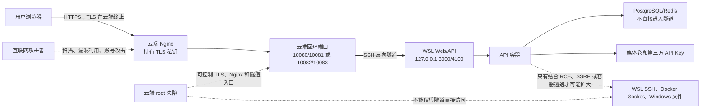

# chat.glimpsetech.cn 云端网关与 WSL 安全防范操作手册

## 0. 文档目的与适用范围

本文用于保护以下部署链路，并在发生攻击时指导隔离、取证、轮换和恢复：

```text
用户浏览器
  → DNS：chat.glimpsetech.cn
  → 云服务器 Nginx：80/443，终止 TLS
  → 云端回环端口：Web/API SSH 反向隧道
  → Windows WSL
  → Docker Compose：Web、API、PostgreSQL、Redis、媒体卷
```

本文与以下部署手册配合使用：

```text
docs/（正式版-WSL）chat.glimpsetech.cn-本地项目域名部署运行手册.md
```

本文不保存任何真实密码、私钥、Token、SMTP 密码或第三方 API Key。示例中的用户名、端口和路径必须先与实际环境核对。

### 0.1 当前已知路径和端口

| 项目 | 当前值 |
| --- | --- |
| 云服务器公网 IP | `43.129.183.132` |
| 云端真实 Nginx 程序 | `/root/bin/nginx` |
| 云端真实 Nginx 主配置 | `/root/glimpse-chat/nginx/nginx.conf` |
| chat 子域名配置 | `/root/glimpse-chat/nginx/conf/conf.d/chat.glimpsetech.cn.dev.conf` |
| Nginx PID | `/root/glimpse-chat/nginx/nginx.pid` |
| TLS 配置目录 | `/root/letsencrypt/config` |
| 云端隧道用户 | `tunnel` |
| 标准 Web/API 隧道端口 | `127.0.0.1:10080/10081` |
| 并行迁移 Web/API 端口 | `127.0.0.1:10082/10083` |
| WSL 项目目录 | `/srv/glimpse-chat-v2` |
| WSL Web/API | `127.0.0.1:3000/4100` |
| WSL PostgreSQL/Redis | `127.0.0.1:5432/6379` |

实际环境发生变化后，先更新本表和部署手册，再执行后续操作。

### 0.2 命令执行位置约定

本文代码块前的文字会标明执行位置：

- **云端 root**：通过管理 SSH 登录云服务器后执行；
- **WSL 用户**：在目标 WSL 发行版中执行；
- **Windows PowerShell（管理员）**：在 Windows 管理员终端执行；
- **外部终端**：从不在云服务器和 WSL 内的独立网络执行。

不要把云端命令误执行到 WSL，也不要把 WSL 的 systemd 命令执行到云服务器。

## 1. 安全目标和必须接受的边界

### 1.1 需要保护的资产

按重要程度至少包括：

1. 用户账号、验证码、会话 Token 和聊天内容；
2. WSL PostgreSQL 数据库和媒体上传卷；
3. 根目录 `.env` 中的 JWT、SMTP、翻译、ASR、TTS 等密钥；
4. WSL SSH 隧道私钥；
5. 云端 TLS 私钥、SSH 主机私钥和运维登录密钥；
6. DNS、腾讯云账号、安全组、EIP 和磁盘快照；
7. Nginx、SSHD、Certbot、systemd 和 Windows 任务计划配置；
8. 可用于恢复的代码、镜像、数据库备份和媒体备份。

### 1.2 当前架构的信任边界

当前 HTTPS 在云服务器 Nginx 终止。云服务器正常时，这种方式便于统一域名、证书和反向代理；但云服务器获得 root 权限后，攻击者可以：



- 读取或修改经过云端的 HTTP 请求和响应；
- 窃取 Cookie、JWT、登录请求、验证码和业务内容；
- 直接访问 `10080/10081` 对应的 WSL Web/API；
- 绕过云端 Nginx 的正常路由、限频和日志策略；
- 向 WSL 发送大量请求，消耗本地 CPU、带宽和数据库连接；
- 尝试利用 Web/API 漏洞进入容器，再向数据库、WSL 或 Windows 横向移动。

反向隧道本身不会自动开放 WSL SSH、PostgreSQL、Redis、Windows 文件共享或 Docker Socket。只有固定配置的 Web/API 目标可通过该隧道访问。但这不是绝对隔离：Web/API 漏洞、SSRF、容器逃逸或错误挂载仍可能扩大影响。

### 1.3 防护原则

1. 云服务器按“可被重建的公网网关”管理，不存放不必要的业务密钥和数据；
2. 隧道只开放 Web/API，永远不转发数据库、Redis、Docker Socket 或本地 SSH；
3. API 自身完成认证、授权、上传校验和限频，不把 Nginx 当作唯一安全边界；
4. 容器按最小权限运行，限制写入、系统能力、进程数、CPU和内存；
5. Windows、WSL、Docker 和云端分别加固，任何一层失陷都不能直接取得下一层全部权限；
6. 密钥定期轮换，备份异机加密保存，并实际演练恢复；
7. 发现云端 root 失陷时，不在原主机上简单“查杀后继续使用”，应隔离并从可信镜像重建。

## 2. 分阶段执行清单

### 2.1 P0：应立即完成

- [ ] 腾讯云主账号启用 MFA，日常操作使用最小权限子账号；
- [ ] DNS/域名账号启用 MFA，删除长期不用的 API 密钥；
- [ ] 云安全组只开放 `80/443`，管理 SSH 端口限制可信来源；
- [ ] 确认 `10080/10081/10082/10083` 均未向公网开放；
- [ ] 确认云端隧道端口只监听 `127.0.0.1`；
- [ ] 确认 WSL 的 `3000/4100/5432/6379` 只监听回环地址；
- [ ] 根 `.env` 和 WSL 隧道私钥权限为 `600`；
- [ ] 确认生产环境没有使用 Compose 中的示例 DB/JWT 默认值；
- [ ] 禁用生产 Swagger，CORS 只允许明确域名；
- [ ] 创建云端配置、WSL 数据库和媒体的首份异机加密备份；
- [ ] 记录“立即切断隧道”命令，并确保管理员知道如何执行；
- [ ] 完成一次公网健康检查、未登录 API 401、Socket.IO 和原主站回归。

### 2.2 P1：建议一周内完成

- [ ] API/Web 容器改为非 root 用户；
- [ ] 为 API/Web 增加 `no-new-privileges`、能力删除和资源限制；
- [ ] 将 API 的 `trust proxy` 从全量信任收紧为经过验证的代理跳数或地址；
- [ ] 根据真实业务把 `750mb` 请求体上限降低或仅应用于确实需要的大文件路由；
- [ ] 云端启用登录失败防护、系统更新、日志轮转和异机告警；
- [ ] 配置磁盘、容器、健康接口、证书到期和隧道掉线告警；
- [ ] 清理迁移完成后不再使用的 macOS 隧道公钥；
- [ ] 导出腾讯云安全组、DNS、EIP 和实例信息；
- [ ] 演练 WSL 隧道断开、云端 upstream 回滚和数据库恢复。

### 2.3 P2：建议一个月内评估

- [ ] API/Web 只读根文件系统和更细的 Docker 网络隔离；
- [ ] 容器镜像漏洞扫描、依赖审计和固定镜像 digest；
- [ ] 集中日志或远程只写日志存储；
- [ ] WSL 使用独立 Windows 运行账户，减少对日常用户文件的访问；
- [ ] 高安全需求下，评估将 TLS 终止移动到 WSL，云端仅做 TCP 转发；
- [ ] 建立季度恢复演练和半年密钥轮换制度。

## 3. 腾讯云账号、DNS 和安全组

### 3.1 云账号

必须执行：

1. 主账号启用 MFA，不创建日常使用的永久访问密钥；
2. 创建单独运维子账号，只授予实例、快照、安全组和必要 DNS 权限；
3. 删除不再使用的子账号、访问密钥和登录设备；
4. 开启登录提醒、异地登录和高风险操作告警；
5. 账单和安全通知使用独立、长期可用的邮箱；
6. 每月导出一次当前子账号和访问密钥清单。

为什么：云平台账号失陷可以直接重置实例密码、替换磁盘、修改安全组或 DNS，其影响高于单个 Linux 用户失陷。

### 3.2 DNS 和域名

必须记录并备份：

- `chat.glimpsetech.cn`、`glimpsechat.com` 及相关验证记录；
- TTL、记录类型、线路和目标值；
- 域名注册商、DNS 服务商、MFA和应急联系人；
- 证书续期使用的域名和通知邮箱。

每月从外部终端检查：

```sh
dig +short chat.glimpsetech.cn A
dig +short glimpsechat.com A
```

输出必须是预期公网地址。出现未知地址时，先冻结 DNS 账号、撤销可疑密钥，再处理服务器。

### 3.3 安全组

建议规则：

| 端口 | 来源 | 说明 |
| --- | --- | --- |
| TCP 80 | `0.0.0.0/0`、`::/0` | HTTP 跳转和 ACME HTTP-01 |
| TCP 443 | `0.0.0.0/0`、`::/0` | 公网 HTTPS |
| 管理 SSH 端口 | 固定办公 IP、可信 VPN 或堡垒机 | 不建议长期全网开放 |
| `10080–10083` | 不添加规则 | 仅云端回环监听 |
| PostgreSQL/Redis | 不添加规则 | 数据服务在 WSL，不应公网开放 |

更改 SSH 来源前必须保留一个已登录管理会话，并确认新来源能够登录，避免把自己锁在服务器外。

## 4. 云服务器操作系统安全

### 4.1 更新和重启窗口

云端 root 先确认系统版本：

```sh
cat /etc/os-release
uname -a
```

TencentOS/RHEL 系通常使用：

```sh
dnf check-update
dnf update --security
```

不要在业务高峰直接执行完整升级。先创建磁盘快照，阅读更新内容，安排维护窗口，并准备 Nginx、SSHD 和隧道验证命令。

至少每月检查安全更新；OpenSSH、OpenSSL、内核和 Nginx 高危漏洞应提高优先级。

### 4.2 SSH 管理登录

当前 `/etc/ssh/sshd_config` 末尾存在 `Match User tunnel`。所有全局 SSH 配置必须放在第一个 `Match` 块之前，否则可能只对 `tunnel` 用户生效。

建议基线：

```text
PubkeyAuthentication yes
PasswordAuthentication no
KbdInteractiveAuthentication no
PermitEmptyPasswords no
MaxAuthTries 3
LoginGraceTime 30
```

若当前仍依赖 root 密钥登录，可先使用：

```text
PermitRootLogin prohibit-password
```

更安全的长期方案是先创建可用的 sudo 管理员、验证第二个终端能够登录和提权，再改为：

```text
PermitRootLogin no
```

每次修改都必须：

```sh
cp -a /etc/ssh/sshd_config /etc/ssh/sshd_config.bak-$(date +%Y%m%d-%H%M%S)
sshd -t
systemctl reload sshd
```

只有 `sshd -t` 无输出且退出码为 0 才能 reload。旧管理会话在新会话验证成功前不得关闭。

### 4.3 防火墙

先判断实际防火墙，不要同时盲目维护 firewalld、nftables 和 iptables 三套规则：

```sh
systemctl is-active firewalld
firewall-cmd --list-all-zones
nft list ruleset
iptables-save
```

合格标准：

- 公网只允许必要的 HTTP、HTTPS 和受限管理 SSH；
- 没有针对 `10080–10083` 的公网放行；
- 没有 PostgreSQL、Redis、Docker API 的公网放行；
- IPv4 和 IPv6 同时检查，不能只封 IPv4。

### 4.4 时间、日志和登录审计

检查时间同步：

```sh
timedatectl status
```

检查近期 SSH 登录：

```sh
last -a | head -n 30
journalctl -u sshd --since '24 hours ago' --no-pager
```

重点告警：

- 非预期国家/地区或 IP 登录；
- root 或管理员在非维护时间登录；
- `authorized_keys`、`sshd_config`、Nginx 配置或证书文件发生变更；
- SSH 失败量突然增加；
- 新增用户、sudoers、cron 或 systemd unit；
- Nginx 主进程、二进制文件或启动参数变化。

重要日志应发送到另一台服务器或云日志服务。攻击者获得 root 后可以修改本机日志，因此只保存在同一主机上的日志不能作为可靠证据。

## 5. 自定义 Nginx 安全操作

### 5.1 永远操作真实实例

本服务器使用：

```text
/root/bin/nginx -c /root/glimpse-chat/nginx/nginx.conf
```

不要使用 `/etc/nginx/nginx.conf`，也不要假设 `systemctl nginx` 管理了当前进程。

检查实际加载配置：

```sh
/root/bin/nginx -T -c /root/glimpse-chat/nginx/nginx.conf 2>&1 \
  | grep -nE 'configuration file .*chat\.glimpsetech\.cn|server 127\.0\.0\.1:(10080|10081|10082|10083)'
```

修改后先检查，再平滑加载：

```sh
/root/bin/nginx -t -c /root/glimpse-chat/nginx/nginx.conf
kill -HUP "$(cat /root/glimpse-chat/nginx/nginx.pid)"
```

禁止在 `nginx -t` 失败时发送 HUP。

### 5.2 Nginx 权限

检查：

```sh
ps -eo user,pid,ppid,args | grep '[n]ginx'
namei -l /root/letsencrypt/config/live/chat.glimpsetech.cn/privkey.pem
stat -c '%a %U:%G %n' /root/letsencrypt/config/live/chat.glimpsetech.cn/privkey.pem
```

要求：

- master 可以由 root 启动，但 worker 应使用专用低权限用户；
- TLS 私钥只允许 root 和确实需要的 Nginx 进程读取；
- Nginx worker 不应拥有修改配置、脚本、证书私钥和二进制的权限；
- 配置目录不能被 `tunnel` 用户写入；
- 日志目录可由 worker 写入，但不能因此让 worker 修改配置。

### 5.3 TLS 和安全响应头

继续只启用 TLS 1.2/1.3，定期检查证书：

```sh
openssl s_client -connect chat.glimpsetech.cn:443 -servername chat.glimpsetech.cn </dev/null 2>/dev/null \
  | openssl x509 -noout -subject -issuer -dates -ext subjectAltName
```

可以逐项评估以下响应头：

```nginx
add_header X-Content-Type-Options "nosniff" always;
add_header Referrer-Policy "strict-origin-when-cross-origin" always;
add_header X-Frame-Options "SAMEORIGIN" always;
```

`Content-Security-Policy` 必须结合 Next.js、WebSocket、媒体、语音和第三方 API 实际来源测试，不能直接复制过严模板上线。HSTS 也只能在确认该域名持续提供 HTTPS 后启用；不要随意添加 `includeSubDomains` 影响其他子域名。

### 5.4 请求和连接限制

当前上传和 API 请求体上限可能达到 `750mb`。大请求容易消耗云端带宽、WSL 内存和磁盘。应统计真实最大附件后：

- 普通 API 使用较小上限；
- 只有媒体上传路由允许必要的大请求；
- 同时限制上传速率、并发、超时和用户配额；
- 为 WebSocket 保留合理长连接，但限制单 IP 连接数；
- 限频不能只放在云端，API 内仍须保留业务限频。

### 5.5 日志轮转与隐私

访问日志不得记录密码、验证码、Authorization、Cookie、完整 Token 或第三方密钥。确认日志轮转、防止磁盘写满：

```sh
du -sh /root/glimpse-chat/nginx/*log 2>/dev/null
df -h
```

安全日志保存时间应满足审计需要；普通访问日志可按隐私政策缩短。日志备份必须限制访问权限。

## 6. SSH 反向隧道安全

### 6.1 云端 `tunnel` 用户基线

云端检查：

```sh
id tunnel
getent passwd tunnel
sshd -T -C user=tunnel,host=localhost,addr=127.0.0.1 | \
  grep -E '^(passwordauthentication|kbdinteractiveauthentication|permittty|x11forwarding|allowagentforwarding|allowtcpforwarding|gatewayports|permittunnel|permituserrc)'
```

期望：

```text
passwordauthentication no
kbdinteractiveauthentication no
permittty no
x11forwarding no
allowagentforwarding no
allowtcpforwarding remote
gatewayports no
permittunnel no
permituserrc no
```

`/home/tunnel/.ssh/authorized_keys` 中每个隧道公钥必须包含精确的 `permitlisten`，例如：

```text
no-agent-forwarding,no-X11-forwarding,no-pty,permitlisten="127.0.0.1:10080",permitlisten="127.0.0.1:10081" ssh-ed25519 AAAA... chat WSL reverse tunnel
```

检查权限：

```sh
chown -R tunnel:tunnel /home/tunnel/.ssh
chmod 700 /home/tunnel/.ssh
chmod 600 /home/tunnel/.ssh/authorized_keys
```

### 6.2 监听检查

云端执行：

```sh
ss -lntp 'sport = :10080 or sport = :10081 or sport = :10082 or sport = :10083'
```

合格标准：

- 只出现当前使用的一组 Web/API 端口；
- 地址必须是 `127.0.0.1`，不能是 `0.0.0.0`、`::` 或公网地址；
- 监听进程应与 SSH 隧道一致；
- 迁移完成后不应长期保留来源不明的第二组隧道。

从外部网络对这些端口的连接必须失败。不要为了测试方便临时把它们加入安全组。

### 6.3 WSL 私钥和主机指纹

WSL 执行：

```sh
chmod 700 "$HOME/.ssh"
chmod 600 "$HOME/.ssh/id_ed25519_chat_tunnel_wsl"
chmod 600 "$HOME/.ssh/known_hosts_chat_tunnel"
ssh-keygen -lf "$HOME/.ssh/id_ed25519_chat_tunnel_wsl.pub"
ssh-keygen -lf "$HOME/.ssh/known_hosts_chat_tunnel"
```

私钥必须位于 WSL Linux 文件系统，不能放在 `/mnt/c`、OneDrive、Git、共享聊天或普通网盘中。`StrictHostKeyChecking=yes` 必须保留。

服务器重建导致主机指纹变化时，不要直接删除 known_hosts。应从腾讯云控制台或独立可信渠道核对新服务器：

```sh
ssh-keygen -lf /etc/ssh/ssh_host_ed25519_key.pub
```

只有指纹核对一致后才更新 WSL 的固定 known_hosts。

### 6.4 密钥轮换

至少每半年轮换一次隧道密钥，以下事件必须立即轮换：

- WSL/Windows 设备丢失或送修；
- 私钥被复制到 Windows 目录、网盘、Git 或聊天；
- 云服务器发生 root 失陷；
- 管理员离职或权限边界变化；
- 无法确认私钥是否泄露。

轮换顺序：

1. WSL 生成新 ed25519 私钥；
2. 云端追加带正确 `permitlisten` 的新公钥；
3. 使用并行端口或维护窗口验证新密钥；
4. 修改 WSL systemd unit 使用新私钥；
5. `systemd-analyze verify` 后重启隧道；
6. 验证公网 Web/API；
7. 删除旧公钥行；
8. 记录指纹、时间和执行人，不记录私钥。

## 7. Windows 和 WSL 安全

### 7.1 Windows 基线

- 启用 BitLocker，并安全保存恢复密钥；
- 启用 Windows Update、Defender 实时保护和防篡改保护；
- 生产服务使用独立 Windows 账户，不使用日常管理员账户；
- 限制远程桌面、SMB 和远程管理，只允许可信网络；
- 禁止机器自动登录；
- 使用强密码和 MFA 保护 Microsoft/企业账号；
- 禁用不必要的启动项和第三方远程控制软件；
- 关闭睡眠或配置适合服务运行的电源策略，同时保留屏幕锁定；
- 备份 Windows 任务计划配置和 WSL 发行版名称。

Windows PowerShell（管理员）检查：

```powershell
Get-BitLockerVolume
Get-MpComputerStatus
Get-NetFirewallProfile
wsl --list --verbose
netsh interface portproxy show all
```

`netsh interface portproxy show all` 不应存在把 WSL 数据库、Redis、API 或 Docker 端口暴露到局域网/公网的未知规则。

### 7.2 WSL 文件和权限

WSL 执行：

```sh
cd /srv/glimpse-chat-v2
stat -c '%a %U:%G %n' .env
find . -maxdepth 3 -type f \( -name '*.pem' -o -name '*.key' -o -name 'id_ed25519*' \) -print
```

要求：

- 项目位于 WSL Linux 文件系统，不在 `/mnt/c`；
- 根 `.env` 权限为 `600`；
- 私钥不在项目目录和 Git 工作区；
- WSL 服务用户不与日常开发账号混用；
- 不把 Windows 用户主目录、SSH 目录或浏览器数据挂载进容器。

修正 `.env`：

```sh
chmod 600 /srv/glimpse-chat-v2/.env
```

### 7.3 降低 WSL 到 Windows 的横向风险

WSL 默认可以访问 `/mnt/c` 并调用部分 Windows 程序。若 WSL 容器或发行版被攻陷，这会扩大到 Windows 用户文件的风险。

优先措施：

1. 使用独立 Windows 运行账户，该账户不保存日常文档和浏览器凭据；
2. 项目、私钥、数据库和备份都放在 WSL Linux 文件系统；
3. 不在服务脚本中读取 `/mnt/c/Users/<日常用户>`；
4. 为 Windows 用户目录配置最小 ACL；
5. 不在 WSL 中长期保存云平台主账号凭据。

高隔离需求下可以评估在 `/etc/wsl.conf` 中关闭自动挂载或 Windows interop，但这可能影响 Docker Desktop、开发工具和运维脚本。只有在使用 WSL 内独立 Docker Engine并完成完整验证后才考虑，不能直接在生产环境照抄。

### 7.4 Docker Desktop 与 WSL 独立 Engine

无论使用哪一种 Engine，云端都只能通过 Web/API 隧道访问本地服务。二者不应同时运行和混用。

- Docker Desktop：只启用目标发行版的 WSL Integration，关闭不需要的发行版集成；
- WSL 独立 Engine：保护 `/var/run/docker.sock`，只有必要服务用户加入 `docker` 组；
- `docker` 组基本等同于 root 权限，不要把普通应用账号随意加入；
- 不启用未加密、未认证的 Docker TCP API；
- 不将 Docker Socket 挂载到 Web/API 容器。

## 8. Docker 和容器安全

### 8.1 当前正确项

当前 Compose 已具备：

- PostgreSQL 只映射 `127.0.0.1:5432`；
- Redis 只映射 `127.0.0.1:6379`；
- Web 只映射 `127.0.0.1:3000`；
- API 默认只映射 `127.0.0.1:4100`；
- 没有 Docker Socket、宿主根目录或 Windows 目录挂载；
- 没有使用 `privileged` 或 `network_mode: host`；
- 数据库、Redis 和应用配置了重启策略与健康检查。

这些设置必须保留。

### 8.2 禁止生产使用默认密钥

Compose 中存在便于开发的默认占位值。生产 `.env` 必须显式设置强随机值，不能落到：

```text
glimpse_secret_change_me
change_me_to_a_random_64_char_string
```

只检查是否存在，不打印密钥：

```sh
cd /srv/glimpse-chat-v2
for key in DB_PASSWORD JWT_ACCESS_SECRET; do
  if grep -qE "^${key}=.+" .env; then
    printf '%s: configured\n' "$key"
  else
    printf '%s: MISSING\n' "$key"
  fi
done

if grep -qE 'glimpse_secret_change_me|change_me_to_a_random_64_char_string' .env; then
  echo 'ERROR: development placeholder found'
else
  echo 'No known placeholder found'
fi
```

不要把 `docker compose config`、`docker inspect` 或完整 `.env` 输出复制到工单和聊天，因为它们可能包含解析后的真实密钥。

### 8.3 容器非 root

当前 Node 运行镜像没有显式 `USER`，因此应分阶段改为 `node` 用户。目标原则：

- API 的程序文件只读；
- `/app/uploads` 归 `node` 用户并保持为唯一业务写入卷；
- entrypoint 可执行但不能被运行用户修改；
- Web 运行时使用 `node` 用户；
- 修改后验证 Prisma migration、上传、ASR/TTS 临时文件和 Next.js 运行。

Dockerfile 目标示例，不可未经测试直接上线：

```dockerfile
RUN chown -R node:node /app/uploads \
  && chmod 755 /app/docker-entrypoint-api.sh
USER node
```

Web runner 同样在启动前增加：

```dockerfile
USER node
```

### 8.4 Compose 最小权限与资源限制

建议先应用到 `api`、`web`，逐项测试：

```yaml
security_opt:
  - no-new-privileges:true
cap_drop:
  - ALL
pids_limit: 256
mem_limit: 1g
cpus: 1.0
```

随后评估：

```yaml
read_only: true
tmpfs:
  - /tmp:size=256m,noexec,nosuid,nodev
```

`read_only` 可能暴露运行时写目录假设。上线前必须验证登录、消息、上传、翻译、ASR、TTS、Prisma migration 和 Web 构建产物访问。不要一次性应用所有限制后跳过回归测试。

数据库和 Redis 镜像有自己的权限与能力需求，不要直接复制 API/Web 的 `cap_drop` 配置。

### 8.5 网络隔离

当前默认 Compose 网络允许所有服务互相解析。长期建议分为：

```text
frontend：web ↔ api
backend：api ↔ db/redis/mailpit
```

Web 不应直接访问 PostgreSQL 和 Redis。API 是唯一同时加入 frontend/backend 的业务服务。网络隔离不能代替账号密码，但能减少 Web 容器失陷后的横向范围。

### 8.6 镜像和依赖

- 基础镜像和依赖至少每月更新评估；
- 生产构建必须使用锁文件；
- 镜像标签最终应固定到经过测试的 digest；
- 使用可信镜像仓库，禁止来源不明的二进制和安装脚本；
- 定期执行 npm/pnpm 审计和容器漏洞扫描；
- 高危漏洞修复后重新构建镜像，不能只重启旧容器；
- 保留当前生产镜像 digest 和对应 Git commit，便于回滚。

记录当前状态：

```sh
cd /srv/glimpse-chat-v2
git rev-parse HEAD
docker compose images
docker image ls --digests
```

## 9. API 和业务安全

### 9.1 代理地址信任

当前 API 使用 `trust proxy=true`，会信任所有代理链中的地址信息。应在测试环境评估改为可信代理跳数，例如一跳：

```ts
app.getHttpAdapter().getInstance().set("trust proxy", 1);
```

修改前后必须验证：

- 正常公网请求记录真实客户端 IP；
- 客户端伪造 `X-Forwarded-For` 不能绕过限频；
- 云端 Nginx 仍正确追加真实地址；
- 本地健康检查不受影响；
- WebSocket 和登录正常。

不能只为了看到真实 IP 就全量信任任意代理头。

### 9.2 认证和权限

- 所有写接口必须在 API 内检查身份和资源所有权；
- 管理员权限不能只依赖前端隐藏按钮或 Nginx 路径；
- 未登录 `/auth/me` 返回 401 是正确行为；
- JWT Secret 至少使用 64 字节随机值，发生泄露时立即轮换；
- 管理员账号启用强密码和独立邮箱告警；
- 验证码存储需要过期、尝试次数和发送频率限制；
- 密码重置、邮箱变更和管理员操作必须记录审计事件；
- 生产环境保持 `ENABLE_SWAGGER=false`。

### 9.3 CORS、Cookie 和 CSRF

- `WEB_ORIGIN` 只包含明确生产域名和确实需要的管理域名；
- 不使用 `*` 配合凭据；
- Cookie 使用 `Secure`、合理的 `HttpOnly` 和 `SameSite`；
- 如果使用 Cookie 完成敏感写操作，应评估 CSRF Token；
- 不把 JWT 放在 URL 查询参数中；
- 前端和日志不得打印完整 Token。

### 9.4 上传、媒体、ASR 和 TTS

- 校验真实文件类型，不只相信扩展名和浏览器 MIME；
- 随机化存储文件名，禁止用户控制磁盘路径；
- 阻止 `../`、绝对路径、符号链接和覆盖已有文件；
- 设置单文件大小、单用户总量、并发和频率限制；
- 媒体下载执行权限检查，不能仅凭可猜 URL；
- 上传目录不允许执行程序；
- 发送到 ASR/TTS/翻译供应商的数据应符合隐私政策；
- 供应商 Key 只放服务端 `.env`，不进入前端构建变量；
- 第三方返回内容按不可信输入处理。

### 9.5 机密轮换周期

| 机密 | 建议周期 | 立即轮换条件 |
| --- | --- | --- |
| JWT Secret | 6–12 个月 | 云端/应用失陷、日志泄露、人员变动 |
| SMTP 密码 | 6 个月 | 异常发信、供应商告警、应用失陷 |
| 翻译/ASR/TTS Key | 3–6 个月 | 费用异常、Key 暴露、应用失陷 |
| WSL 隧道密钥 | 6 个月 | 设备丢失、云端 root 失陷、误上传 |
| 云端管理员密钥 | 6 个月 | 管理设备丢失、人员变动、异常登录 |
| 数据库密码 | 6–12 个月 | API/数据库失陷或备份泄露 |

轮换必须有回滚和验证步骤。JWT Secret 轮换会使现有会话失效，应提前通知用户并安排窗口。

## 10. 备份与恢复

### 10.1 云端必须备份

- `/root/glimpse-chat/nginx/nginx.conf`；
- `/root/glimpse-chat/nginx/conf/`；
- `/root/glimpse-chat/scripts/reload-nginx-after-cert-renewal.sh`；
- `/root/letsencrypt/config/` 整体，不能只备份 `live/`；
- `/etc/cron.d/glimpse-letsencrypt-renew`；
- `/etc/ssh/sshd_config`；
- `/home/tunnel/.ssh/authorized_keys`；
- `/etc/ssh/ssh_host_*`；
- 自定义 `/root/bin/nginx` 及 `nginx -V`、checksum、依赖记录；
- 安全组、DNS、EIP、实例规格和磁盘信息。

不需要作为配置恢复包保存：Nginx PID、缓存、ACME challenge 临时 token 和 Certbot work 临时目录。

TLS 私钥、SSH 主机私钥和 authorized_keys 备份必须加密。旧主机仍在线时，不能把同一 SSH 主机私钥同时部署到另一台活动服务器。

### 10.2 WSL 必须备份

- PostgreSQL `pg_dump -Fc` 逻辑备份；
- `uploads` 媒体卷归档；
- 根 `.env` 加密副本；
- systemd unit；
- Windows 任务计划导出；
- 当前 Git commit、镜像 digest 和依赖锁文件；
- 必要时执行 `wsl --export` 作为整机辅助快照。

`wsl --export` 不能代替数据库逻辑备份和媒体文件校验。

### 10.3 3-2-1 原则

至少：

- 3 份数据；
- 2 种不同介质；
- 1 份异机或离线副本。

推荐：

```text
WSL 当前数据
  + 本地加密备份盘
  + 异地加密对象存储
```

云服务器自身磁盘上的 `/root/backup` 不是异机备份。腾讯云快照适合快速恢复，但仍应有独立导出的加密配置包。

### 10.4 恢复演练

每季度至少恢复一次到隔离环境，验证：

1. PostgreSQL 能恢复并通过数据计数；
2. 媒体文件数量、大小和抽样下载一致；
3. Nginx `-t` 成功；
4. SSHD `-t` 成功；
5. Certbot 能识别证书，dry-run 成功；
6. WSL Web/API 健康；
7. 公网或隔离域名登录、会话、消息、上传、ASR/TTS 正常；
8. 恢复过程没有把真实用户邮件或第三方费用请求发送出去。

## 11. 监控与巡检

### 11.1 每日自动检查

- HTTPS 状态码和证书剩余时间；
- `/health` 和 `/health/ready`；
- Socket.IO handshake；
- WSL `glimpse-chat.service` 和 `glimpse-tunnel.service`；
- Docker 容器健康和重启次数；
- 云端隧道监听地址；
- WSL 和云端磁盘空间；
- Nginx 5xx、API 5xx、401/403/429 异常增幅；
- SMTP、翻译、ASR、TTS 用量和费用异常。

告警必须发送到不依赖该项目本身的邮箱、短信或监控平台。

### 11.2 每周人工巡检

云端：

```sh
ss -lntp 'sport = :10080 or sport = :10081 or sport = :10082 or sport = :10083'
/root/bin/nginx -t -c /root/glimpse-chat/nginx/nginx.conf
journalctl -u sshd --since '7 days ago' --no-pager
df -h
```

WSL：

```sh
cd /srv/glimpse-chat-v2
systemctl status glimpse-chat.service glimpse-tunnel.service --no-pager
docker compose ps
docker compose logs --since 24h --tail 300 api web db redis
df -h
curl --noproxy '*' -fsS http://127.0.0.1:3000/health
curl --noproxy '*' -fsS http://127.0.0.1:4100/health/ready
```

注意：`glimpse-chat.service` 显示 `active (exited)` 是 oneshot + `docker compose up -d` 的正常状态，实际健康必须以 `docker compose ps` 和接口检查为准。

### 11.3 每月检查

- 云端、Windows、WSL、Docker 镜像和依赖更新；
- 云账号、DNS 账号、访问密钥和管理员清单；
- 安全组与防火墙；
- `authorized_keys` 和 SSH 主机指纹；
- 证书剩余时间和 Certbot dry-run；
- 备份完成记录、checksum 和异机副本；
- 数据库增长、媒体增长和磁盘容量；
- API Key 用量、账单和供应商登录记录；
- Git 分支、生产 commit 和镜像 digest 对应关系。

## 12. 安全事件应急处置

### 12.1 需要启动应急流程的信号

- 云平台或 SSH 出现未知管理员登录；
- Nginx/SSHD/authorized_keys 被未知修改；
- 域名解析或证书被未知替换；
- 服务器出现未知用户、cron、systemd unit 或进程；
- WSL 容器出现未知进程、异常出站连接或文件修改；
- 数据库出现未知管理员、批量导出、删除或加密；
- SMTP/API Key 费用或调用量异常；
- 用户 Token 大规模失效、异常登录或数据被篡改；
- 不能解释的 502、重定向、恶意页面或浏览器证书告警。

### 12.2 云服务器疑似 root 失陷：立即动作

第一优先级是从 WSL 切断隧道。WSL 执行：

```sh
sudo systemctl disable --now glimpse-tunnel.service
```

确认不再连接：

```sh
systemctl status glimpse-tunnel.service --no-pager
ps -ef | grep '[s]sh.*chat_tunnel'
```

随后：

1. 从腾讯云控制台隔离实例或收紧安全组；
2. 在隔离前按事件响应要求创建磁盘快照，保存证据；
3. 将 DNS 切换到维护页或新建的干净网关；
4. 不让 WSL 重新连接疑似失陷的云服务器；
5. 不信任原服务器上的日志、二进制和配置 checksum；
6. 从可信镜像创建新实例，重新配置 Nginx、SSHD 和证书；
7. 通过独立渠道核对新 SSH 主机指纹；
8. 更换隧道密钥、云端管理员密钥和 TLS 私钥；
9. 完成密钥轮换与本地检查后才恢复隧道。

### 12.3 需要轮换的凭据

按影响范围处理：

1. 云平台主账号、子账号和 API 访问密钥；
2. DNS/域名账号；
3. 云端管理员 SSH 密钥和 SSH 主机密钥；
4. WSL 隧道私钥；
5. TLS 私钥，重新签发并按需要撤销旧证书；
6. JWT Secret，使已有 Token 失效；
7. SMTP、翻译、ASR、TTS 和其他供应商 Key；
8. 数据库密码和管理员密码；
9. 备份加密密码。

不要在已经失陷的云服务器上生成新密钥。

### 12.4 本地应用疑似被利用

在切断隧道后：

```sh
cd /srv/glimpse-chat-v2
docker compose ps --all
docker compose logs --since 48h api web db redis
docker image ls --digests
git status --short --branch
git rev-parse HEAD
```

保存日志、容器元数据、数据库审计信息和异常文件列表。若攻击仍在进行，可停止业务入口：

```sh
docker compose stop api web
```

不要在保留证据前执行清理日志、删除容器或覆盖文件。完成取证后，从可信 commit 和基础镜像重新构建；不要把未知容器直接重新启动后继续提供服务。

如果 API 容器被取得代码执行权限，应默认以下内容可能已经泄露：

- 容器环境变量；
- JWT、SMTP 和第三方 API Key；
- 数据库与 Redis 内容；
- 上传媒体卷；
- 容器可访问的内部网络服务。

容器 root 不等于 WSL/Windows root，但必须检查 Docker、WSL、Windows Defender 和相关账号是否存在横向活动。

### 12.5 恢复上线条件

全部满足后才能恢复：

- 新云服务器来自可信镜像且已更新；
- 云平台、DNS、SSH、TLS、隧道和应用密钥已经轮换；
- Nginx/SSHD 配置通过语法检查；
- 隧道只监听云端回环地址；
- 本地容器从可信代码和镜像重建；
- 数据库和媒体完成一致性与恶意内容检查；
- Web/API/Socket.IO/邮箱/翻译/ASR/TTS 验证通过；
- 原主站回归通过；
- 日志和告警已经恢复；
- 事件原因、影响范围和修复记录已经归档。

## 13. 高安全架构选项

当前云端终止 TLS，因此云端 root 能读取和修改业务流量。如果安全目标要求“云服务器失陷后仍不能读取聊天和登录内容”，需要改为：

```text
浏览器 HTTPS
  → 云服务器只做四层 TCP 转发
  → SSH/VPN 隧道
  → WSL 内终止 TLS
```

TLS 私钥只保存在 WSL。这样云端仍可拒绝服务或错误转发流量，但不能直接解密和合法篡改 HTTPS 内容。

注意：

- 单纯增加 WireGuard 或第二层 SSH 加密不能解决云端终止 TLS后的明文问题；
- 云端持有客户端证书时，mTLS 也不能抵抗云端 root；
- TLS 下沉会改变证书申请、续期、健康检查和 Nginx 配置；
- 必须设计新架构、测试回滚后再迁移，不能直接修改生产 443 转发。

对于高敏感数据，还应考虑把生产服务放在独立、长期在线的专用机器，而不是日常办公 Windows 设备。

## 14. 上线前安全验收表

| 检查项 | 命令或证据 | 合格标准 |
| --- | --- | --- |
| 云账号 | 控制台 MFA/子账号清单 | 主账号 MFA，日常使用最小权限子账号 |
| DNS | `dig` 与控制台导出 | 仅有预期记录和管理员 |
| 安全组 | 控制台规则 | 10080–10083、5432、6379 不开放公网 |
| SSHD | `sshd -t`、`sshd -T` | 语法正确，tunnel 限制全部生效 |
| 隧道授权 | authorized_keys 检查 | 独立 Key，精确 permitlisten，无过期公钥 |
| 云端监听 | `ss -lntp` | 隧道只监听 127.0.0.1 |
| Nginx | 真实路径 `nginx -t` | syntax ok/test successful |
| TLS | `openssl s_client` | 域名正确、证书有效、TLS 1.2/1.3 |
| WSL 监听 | `ss -lntp` | 3000/4100/5432/6379 只绑定回环 |
| `.env` | `stat`、占位值检查 | 权限 600，无默认密码，不输出内容 |
| Docker Socket | Compose/挂载检查 | 不挂载进业务容器，不开放 TCP API |
| 容器权限 | `docker inspect` | API/Web 非 root，逐步启用最小权限 |
| 容器资源 | Compose/压力测试 | CPU、内存、PID 和日志有限制 |
| API 代理 | XFF 伪造测试 | 不能通过伪造代理头绕过限频 |
| CORS/Swagger | 生产配置 | 明确 origin，Swagger 关闭 |
| 上传 | 类型、路径、配额测试 | 不可路径穿越、覆盖、执行或越权下载 |
| 备份 | checksum、异机副本 | 数据库/媒体/配置加密备份完整 |
| 恢复 | 最近演练记录 | 季度恢复成功且数据核对一致 |
| 告警 | 模拟故障 | 隧道、健康、磁盘、证书和异常登录可告警 |
| 应急 | 隧道切断演练 | 管理员能在 5 分钟内隔离入口 |

## 15. 维护记录模板

每次安全变更至少记录：

```text
日期时间：
执行人：
变更对象：云平台 / DNS / 云服务器 / WSL / Docker / 应用
变更原因：
变更前备份或快照：
执行命令或控制台操作：
验证结果：
回滚方法：
关联 Git commit / 镜像 digest：
是否涉及密钥轮换：是 / 否
是否通知用户：是 / 否
```

记录中只能保存密钥名称、指纹和轮换时间，不能保存真实密钥内容。

## 16. 最终执行顺序

如果只能逐步实施，按以下顺序：

1. 先保护云账号、DNS 和 SSH 管理入口；
2. 收紧安全组和所有监听地址；
3. 验证隧道用户、authorized_keys 和主机指纹；
4. 检查 `.env`、生产密钥和数据库/Redis绑定；
5. 建立云端配置、数据库和媒体的异机加密备份；
6. 配置健康、证书、磁盘、登录和用量告警；
7. 将 API/Web 改为非 root，并增加容器资源和权限限制；
8. 收紧 `trust proxy`、上传限制、CORS和管理员接口；
9. 完成一次云端失陷切断隧道演练和恢复演练；
10. 根据数据敏感程度评估 TLS 下沉和专用生产主机。

安全防护不是一次性配置。任何代码、域名、端口、供应商 Key、Docker Engine 或机器迁移后，都应重新执行第 14 节验收表。
